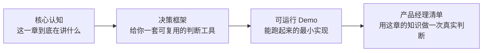

# 00 前言：我为什么要写这套东西

## 一个真实的开场

去年之前，我还是个纯纯的产品经理——在腾讯做过游戏安全方向的产品，管过反外挂、举报治理、UGC 内容安全这些"看不见但很重要"的事情。我从来没写过什么 Agent，甚至一开始对"Agent"这个词是有点警惕的：又一个被资本和大厂吹起来的概念？

转折点是我自己动手做了几件事：

1. 给团队做了一个**企业微信群机器人**，@它就能自动查游戏数据报表、回答业务问题——从最初接Dify 工作流，到后来发现 Dify 有局限，自己写了一整套"MCP Server + REST API"的架构。
2. 把七零八落的**举报服务知识库**、**安全运营周会记录**这些散落在文档、群聊、会议里的知识，用 LLM 抽取实体、做跨源关联，喂给了一个能回答"这个数据异动和上周的策略调整有没有关系"这种因果问题的知识库 Agent。
3. 后来转型做独立的 AI 产品，开始给自己做一些"小而美、下载即用"的工具，也全部是用 Agent 的思路在搭。

做完这几件事之后，我才真正理解——**Agent 不是一个新技术名词，是一种新的"产品该怎么长成"的方式。** 而市面上大多数教程只讲"技术怎么长成"，很少讲"产品该怎么长成"。这就是这套内容存在的理由。

## 和别的资料的关系

在系统学习的过程中，我完整读完并实践了 Datawhale 社区的 [hello-agents](https://github.com/datawhalechina/hello-agents)——这是一份工程质量很高的公开课，从 ReAct 范式手写实现到 Agentic RL 全流程训练都覆盖了，非常推荐工程背景的同学去读。

但读完之后我发现两个缺口：

- **产品判断力的缺口**：教程教会了"怎么实现"，但没有回答"什么时候该做、什么时候不该做、做到什么程度就够了"——这些恰恰是产品经理每天要做的决策。
- **真实案例的缺口**：教学案例（旅行助手、赛博小镇）设计得很巧妙，但离"这东西怎么真的卖给用户/怎么真的在公司里落地"还有一段距离。

所以 AgentCraft 不是要替代它，而是站在产品经理的视角，把整个知识体系重新组织了一遍，并且把我自己真实做过的项目案例放进来，填上这两个缺口。内容、结构、代码全部是我自己重新写的。

## 这套东西的写作约定

为了不写成"又一份东西读完就忘"的教程，AgentCraft 的每一章都固定这个结构：

- **核心认知**：用最少的字讲清楚一个概念，拒绝为了显得专业而堆砌术语。
- **决策框架**：凡是能画成表格/流程图的判断逻辑，我都会画出来，而不是让你自己悟。
- **可运行 Demo**：不是每章都有独立代码，但整套书至少保证若干个关键节点有"5分钟跑起来"的东西。
- **产品经理清单**：章末的一组问题，逼自己把知识用在一次真实判断上。

## 谁适合读、怎么读

- 如果你是**想转型 AI 产品经理**的人：建议顺序读 Part 1 → Part 4 → Part 5，代码细节可以跳过，重点啃每章的"决策框架"和"产品经理清单"。
- 如果你是**工程师**，想知道产品经理到底在纠结什么：Part 1 快速过一遍建立共同语言，然后可以直接跳去看 Part 4 的真实项目复盘。
- 如果你是**独立开发者**：直接冲 Part 4 + Part 5，那里全是"抄作业"级别的方法论。

好了，废话讲完，我们从"到底什么是 Agent"这个最容易被忽悠的问题开始。

—— Harry，2026 年8 月
