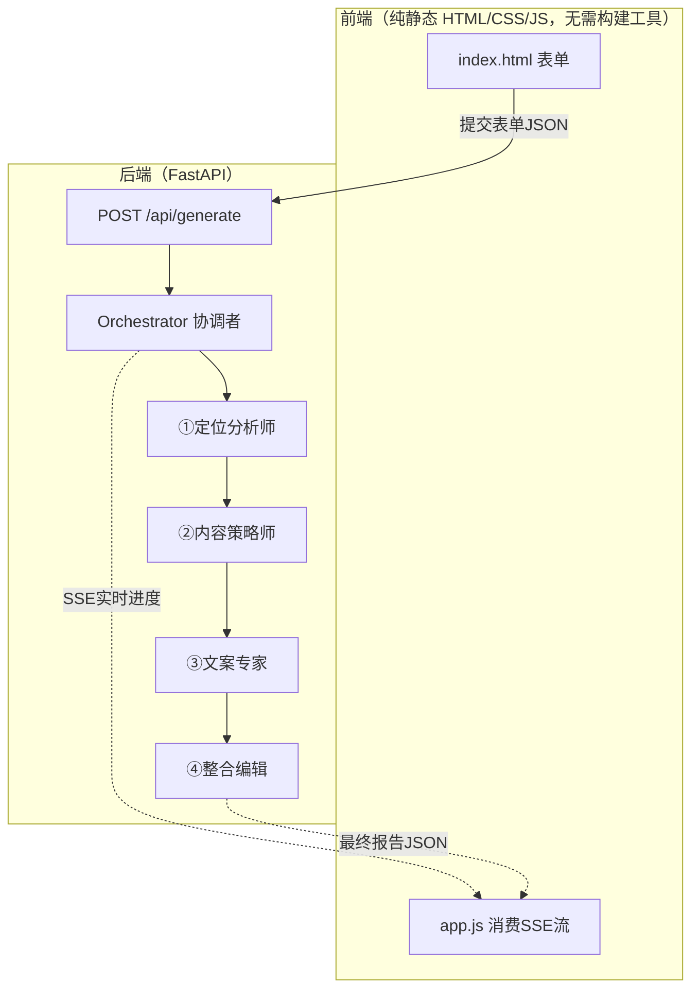
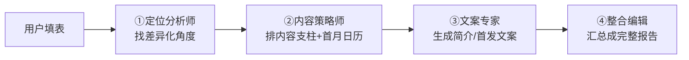

# 番外 02　全栈实战：从0搭一个「个人品牌定位 Agent」（前端+后端+多智能体协作）

> 本篇属于「番外篇」，不计入主线 6 个 Part / 23 章的编号体系。这是全课程**第一个可以 clone 下来直接跑起来的完整 Web 应用**——之前的 6 个 demo（demos/01~06）都是命令行级别的最小示例，这一篇是前端+后端+多智能体协作的完整产品形态，对应课程配套代码 [`demos/07-personal-brand-agent`](https://github.com/harryjzhang69-web/harry-agent-course/tree/main/demos/07-personal-brand-agent)。

## 为什么要做这个、为什么选这个场景

之前对比过 Datawhale 社区的 hello-agents 教程，发现他们 Part4 用三章篇幅（智能旅行助手/深度研究智能体/赛博小镇）教读者搭**完整的全栈应用**，而我们的 Part4 只有"真实项目复盘"这种叙事型内容，没有一个能直接 clone 跑起来的完整产品。这一篇就是补这个缺口。

场景选**「个人品牌定位 Agent」**，不是随手挑的：

- 这套课的核心读者就是"转型 AI 产品经理"的人，本身就需要给自己做一次定位——用自己的真实信息跑一遍，产出的东西能直接用，不是"演示完就扔"的玩具案例
- 呼应课程 [关于作者](https://harryjzhang69-web.github.io/harry-agent-course/README.md) 里提到的"清华学长harry / AI产品手艺人"定位方法论，你可以直接用这个工具帮别人（或帮自己）做一次定位分析

## 整体架构：一图看懂前后端怎么协作



**技术选型的取舍说明**（这是产品/工程视角比纯代码教程更值得讲的部分）：

- **前端不用任何构建工具**（没有 Vue/React、没有 npm install）：这套课的核心读者很多没有完整前端开发环境，纯静态 HTML 能让"clone 下来就能跑"这件事真正成立，而不是先卡在环境配置上劝退一半读者。hello-agents 的三个全栈案例都用了 Vue3+TypeScript，工程更完整，但对纯产品经理背景的读者门槛更高——这是我们刻意做的简化取舍，不是能力不够。
- **用 SSE 而不是等全部跑完再一次性返回**：4次LLM串行调用通常要15~40秒，纯白屏等待体验很差。把中间状态暴露给用户，是"怎么设计长耗时任务的体验"的具体示范。

## 数据模型设计：先想清楚每个 Agent 之间"传什么"

在写任何 Agent 代码之前，先定义清楚每一步的输入输出结构（`backend/models.py`），这一步很多教程会跳过，但恰恰是最容易出问题的地方——**结构不清晰，Agent之间就会"传歪"**。

```python
class PositioningResult(BaseModel):
    """定位分析师 Agent 的输出"""
    one_liner: str            # 一句话定位
    differentiators: List[str]  # 3个差异化角度
    persona_hooks: List[str]    # 目标受众会被打动的3个钩子
    risk_warning: Optional[str] # 这个定位的风险提示（可能为空）
```

用 Pydantic 定义（而不是裸字典），有两个直接好处：LLM 返回的 JSON 反序列化时会自动校验字段类型，缺字段/字段类型不对会立刻报错，不会带着一个"看起来正常但缺胳膊少腿"的数据往下传；FastAPI 接口的请求/响应也直接复用同一套模型做校验。

完整的4个数据模型（`UserProfile`→`PositioningResult`→`ContentStrategyResult`→`CopywritingResult`→`BrandReport`）串成一条链，前一个的输出就是后一个的输入的一部分。

## 四个 Agent 怎么分工



为什么拆成4个而不是写一个超长 Prompt 让一个 Agent 一次性搞定？因为**每一步的判断逻辑不一样，混在一起 Prompt 会互相干扰**：定位分析师要做的是"从背景里挖差异化"，内容策略师要做的是"把定位翻译成可执行计划"，这两件事对模型的要求完全不同（前者需要"敢于指出风险"，后者需要"具体到能直接拿去写"），拆开写反而更容易把每一步的要求写清楚、写到位。

### ①定位分析师：故意要求模型"说风险"

```python
SYSTEM_PROMPT = """你是一名资深的个人品牌定位顾问...
{
  "one_liner": "一句话定位，15字以内，要具体、能被记住，不要空话",
  "differentiators": ["差异化角度1", "差异化角度2", "差异化角度3"],
  "persona_hooks": ["目标受众痛点钩子1", "痛点钩子2", "痛点钩子3"],
  "risk_warning": "这个定位如果有风险，在这里指出来；如果没有明显风险，填 null"
}

要求：
- 如果背景信息本身比较普通、缺乏差异化，要在 risk_warning 里如实指出，而不是硬编一个假的差异化角度
"""
```

这个 `risk_warning` 字段是故意设计的——**如果不明确要求模型"可以说没有差异化"，模型会倾向于永远给你编一个看起来合理的差异化角度，哪怕背景信息本身很普通**。这是 Prompt 设计里一个常见的坑：模型有"讨好式回答"的倾向，你得明确给它一个"说出问题"的许可和场景。

真实跑出来的效果（输入"清华硕士，前腾讯游戏产品经理"）：

```json
{
  "one_liner": "清华腾讯背景的AI产品经理转型教练",
  "risk_warning": "定位可能偏窄，仅针对想转型AI产品经理的人群，且需突出与同类转型教练的差异化，避免同质化。"
}
```

模型正确识别出了"清华+腾讯"这个信任背书，同时也如实指出了定位偏窄的风险，而不是一味地夸这个定位多么完美。

### ②内容策略师：把"定位"翻译成"具体要发什么"

内容策略师接收上一步的完整输出（定位、差异化角度、受众钩子），产出3~4个内容支柱+首月内容日历+分渠道打法。Prompt 里特意要求"不要写成'分享一些心得'这种空话标题，要具体到能直接拿去写"——这是应对 LLM 另一个常见问题：如果不明确要求具体性，模型很容易输出一堆听起来对但没法直接用的空泛建议。

真实跑出来的选题示例（不是编的，是实测输出）：
- "从腾讯游戏PM到AI产品经理：我的转型时间线与关键决策"
- "不懂代码也能懂Agent：用产品思维拆解Agent开发全流程"
- "腾讯AI产品经理的一天：从晨会到模型评估的完整流程"

都是具体到能直接开始写的标题，不是"聊聊我的转型经历"这种空泛表达。

### ③文案专家：明确禁止"营销口吻"

```python
SYSTEM_PROMPT = """你是一名擅长个人品牌文案的写手，语言要真实、有手艺感，\
不要写成培训机构式的营销口吻，不要堆砌"赋能""链接""闭环"这类空话。
"""
```

这一条限制直接对应课程作者本人的定位方法论（"匠人式产出，不是大厂PM话术"）——**Prompt里写清楚"不要什么"，往往比"要什么"更能纠正模型的默认倾向**，因为营销腔恰好是大模型训练数据里过采样的一种文风。

### ④整合编辑：故意不用LLM排版

```python
@staticmethod
def _render_markdown(profile, positioning, strategy, copywriting, editor_summary) -> str:
    """
    这一步故意不再调用 LLM，而是用 Python 模板直接拼装——
    因为报告的"结构"是确定的，没必要为了排版再花一次 LLM 调用的钱和时间
    """
```

第四步只用了一次 LLM 调用（生成一段总览点评），报告本身的排版拼装是纯 Python 字符串模板完成的。这是"哪些环节该用LLM、哪些该用确定性代码"的具体示范——**报告结构是完全确定的（标题->定位->策略->文案的顺序永远不变），用LLM去生成这种确定性排版是浪费钱和时间，还多一次出错的机会**。

## 后端怎么把进度实时推给前端：SSE + 后台线程

```python
def worker():
    """orchestrator.run 是同步阻塞调用，放到后台线程跑，
    主线程的生成器只负责从队列里实时取事件并 yield 出去"""
    def on_progress(stage, status, message):
        event_queue.put(("progress", {...}))
    report = orchestrator.run(req.profile, on_progress=on_progress)
    event_queue.put(("done", {"report": report.model_dump()}))

def event_stream():
    thread = threading.Thread(target=worker, daemon=True)
    thread.start()
    while True:
        event_name, payload = event_queue.get()
        if event_name is SENTINEL:
            break
        yield f"event: {event_name}\ndata: {json.dumps(payload)}\n\n"
```

关键设计：`orchestrator.run()` 本身是同步阻塞的（4次LLM调用挨个发生），如果直接在生成器里调用它，前端只会在全部跑完那一瞬间收到所有事件，看不到"实时"进度。解决方式是把它扔到一个后台线程里跑，主线程的生成器专心从队列里"实时"取事件并推给前端——**第一个 Agent 跑完的瞬间，前端就能立刻收到那条进度更新**，不用等剩下3个Agent也跑完。

前端消费 SSE 流的核心逻辑（`frontend/app.js`）：

```javascript
const reader = resp.body.getReader();
while (true) {
  const { done, value } = await reader.read();
  if (done) break;
  buffer += decoder.decode(value, { stream: true });
  const chunks = buffer.split("\n\n");
  buffer = chunks.pop() || "";
  for (const chunk of chunks) {
    const eventName = chunk.match(/event:\s*(\w+)/)[1];
    const payload = JSON.parse(chunk.match(/data:\s*(.*)/s)[1]);
    if (eventName === "progress") updateProgress(payload.stage, payload.status, payload.message);
    else if (eventName === "done") renderReport(payload.report);
  }
}
```

用原生 `fetch` + `ReadableStream` 手动解析 SSE 格式（而不是用浏览器内置的 `EventSource`），是因为 `EventSource` 只支持 GET 请求，我们的接口需要 POST 提交表单数据，只能手动解析流。

## 保姆级：从0跑起来

**Step 1：环境准备**

```bash
cd demos/07-personal-brand-agent
pip install -r requirements.txt
```

**Step 2：配置 API Key**

复制 `.env.example` 为 `.env`，或者直接在终端里 export：

```bash
export OPENAI_API_KEY=sk-xxxx
export OPENAI_BASE_URL=https://api.deepseek.com   # 换成你用的服务商
export OPENAI_MODEL=deepseek-chat
```

**Step 3：启动服务**

```bash
python backend/app.py
```

看到这行输出就说明启动成功：

```
个人品牌定位 Agent 已启动：http://127.0.0.1:8420
```

**Step 4：打开浏览器**

访问 `http://127.0.0.1:8420`，左侧填表（姓名/背景/技能/目标受众），点「开始生成定位报告」，右侧会实时显示4个Agent的执行进度，跑完后展示完整报告，可以点右上角「导出 Markdown」下载。

## 常见踩坑

| 现象 | 原因 | 解决 |
|---|---|---|
| 访问首页显示 `{"detail":"Not Found"}` | 静态文件挂载路径写错，或者 `frontend/` 目录不存在 | 检查 `backend/app.py` 里 `FRONTEND_DIR` 计算出的路径是否正确指向 `frontend/` |
| 提交表单后一直转圈不返回 | API Key没配置/配置错误，或者网络访问不了该服务商 | 先访问 `/api/health` 看 `llm_configured` 是否为 `true`；再检查 `OPENAI_BASE_URL` 是否填对 |
| Agent返回内容解析失败报错 | LLM返回的内容被markdown代码块```json包裹，或者夹带了解释性文字 | 代码里 `_parse_json_response()` 已经做了兜底清洗，如果还是失败，多半是模型完全没按JSON格式输出，考虑换个更听话的模型或者在Prompt里加更强的格式约束 |
| SSE进度一直不更新，等很久才一次性出现全部结果 | 正常现象——orchestrator内部4次LLM调用是串行的，每一步本身就要几秒到十几秒 | 不是bug，是真实耗时，如果嫌慢可以考虑把定位分析师和内容策略师并行化（但要注意内容策略师依赖定位分析师的结果，不能完全并行） |

## 拓展任务（建议实际操作）

1. **加一个"同类定位对标搜索"工具**：参照 Part2 第05章 ReAct 案例用 SerpApi 搜索工具的方式，给定位分析师加一个真实搜索工具，让它能查到真实的同类账号定位做参考，而不是完全靠模型的预训练知识。
2. **让风险提示真正影响下游决策**：现在的设计里，`risk_warning` 只是展示给用户看，后面3个Agent完全不知道这个风险存在。试着把 `risk_warning` 传给内容策略师，让它在定位偏窄的情况下主动建议"泛化打法"或"垂直深耕打法"两个方向供用户选择。
3. **把前端也做成可离线用的静态导出**：现在报告只能在浏览器里看+导出Markdown，试着加一个"导出为可分享的独立HTML文件"功能（把报告内容和样式打包进一个单文件）。

## 章节自测（5道单选，答案见文末）

**Q1.** 这个项目和之前 demo01~06 最本质的区别是什么？
A. 代码量更多　B. 是一个能clone直接跑起来的完整全栈Web应用（前端+后端+多Agent协作），不是命令行级最小示例　C. 用了更贵的模型　D. 没有区别

**Q2.** 为什么用 Pydantic 定义每个Agent的输入输出，而不是用裸字典传递？
A. Pydantic运行更快　B. 结构不清晰容易让Agent之间"传歪"，Pydantic能自动校验字段类型和缺失字段　C. 只是代码风格偏好，没有实际影响　D. FastAPI强制要求

**Q3.** 定位分析师Prompt里要求 `risk_warning` 字段"如果背景普通就如实指出"，这是为了解决什么问题？
A. 减少Token消耗　B. 模型有"讨好式回答"倾向，不明确许可就会硬编一个假的差异化角度　C. 加快响应速度　D. 避免版权问题

**Q4.** 整合编辑Agent生成最终报告时，为什么排版拼装用Python字符串模板而不是再调一次LLM？
A. LLM不会排版　B. 报告结构是确定的，用LLM生成确定性排版是浪费钱和时间，还多一次出错机会　C. Python模板效果更好看　D. 没有实际原因，随意选择

**Q5.** 前端为什么用原生 fetch+ReadableStream 手动解析SSE，而不是用浏览器内置的 EventSource？
A. EventSource已被废弃　B. EventSource只支持GET请求，接口需要POST提交表单数据　C. fetch性能更好　D. 没有区别，两者等价

<details>
<summary>点击查看参考答案</summary>

1-B　2-B　3-B　4-B　5-B

</details>
