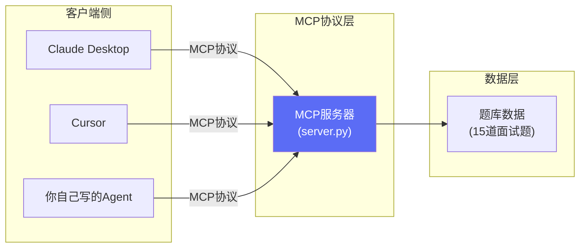

# 番外03：零基础保姆级——从零搭一个 MCP 服务器，并接入真实客户端

> 本篇属于「番外篇」，不计入主线 6 个 Part / 23 章的编号体系。对应主线 [Part3 第11章《通信协议速查》](https://harryjzhang69-web.github.io/harry-agent-course/book.html#/docs/part3/11-通信协议速查)——11章解决的是"MCP/A2A/ANP 这几个协议分别是什么、什么时候该用"的**判断**，这一篇解决"具体怎么用手，把一个能力真的做成一个标准 MCP 服务器"的**操作**。配套可运行代码：[`demos/09-custom-mcp-server`](https://github.com/harryjzhang69-web/harry-agent-course/tree/main/demos/09-custom-mcp-server)。

## 为什么要学这个：MCP 服务器不是"只有大厂才需要搭"的东西

11章讲过 MCP 的核心价值类比"USB接口"——一次实现，多方复用。但很多人对"搭一个MCP服务器"这件事有个误解：以为这是给 Claude/OpenAI 这类平台方做的基础设施活，产品经理/个人开发者用不上。

真实情况恰恰相反：**你自己团队内部的任何一个"经常被问、经常要查"的能力**（比如"查一下这个报表的最新数据""查一下这道面试题该怎么答""查一下这个客户的工单状态"），一旦发现有超过一个客户端/场景需要用它（比如你自己的Agent要用、同事的Cursor也想用、以后接入企业微信机器人也要用），就值得包一层MCP协议——这样只需要维护一份服务端逻辑，所有客户端都能直接"插上就用"。

这一篇会带你把课程自己的 [Part5 第19章《转型面试题库》](https://harryjzhang69-web.github.io/harry-agent-course/book.html#/docs/part5/19-转型面试题库) 封装成一个真实的 MCP 服务器——选这个场景是有意为之：这样你能直接对比"同一份题库数据，番外01里包给 Coze 用的是知识库+RAG检索的方式，这一篇包给 MCP 客户端用的是结构化工具调用的方式"，两种技术路径的差异会更直观。



三个客户端共用同一个服务器、同一份数据——这就是"一次实现，多处复用"的真实样子，不是抽象概念。

## Step 1：环境准备

MCP 官方 Python SDK（包名 `mcp`）要求 **Python 3.10 及以上**。先确认你的版本：

```bash
python --version
```

如果低于3.10（比如还在用3.9），需要先装一个新版本（推荐用 `pyenv`，或者直接去 python.org 下载安装包），并在新版本环境里执行后续步骤。

安装 SDK：

```bash
pip install mcp
```

> 💡 这一步我们已经实测过：在本机 Python 3.9 环境下执行 `pip install mcp` 会直接报 `ERROR: Could not find a version that satisfies the requirement mcp`——这不是网络问题，是版本门槛卡住了，升级Python才是唯一解法，别在网络设置上排查浪费时间。

## Step 2：写服务器代码——3个工具，每个不到15行

完整代码见 [`demos/09-custom-mcp-server/server.py`](https://github.com/harryjzhang69-web/harry-agent-course/blob/main/demos/09-custom-mcp-server/server.py)，核心结构只有三部分：

```python
from mcp.server.fastmcp import FastMCP

mcp = FastMCP(name="interview-question-bank", instructions="...")

QUESTIONS = [...]  # 题库数据（15道题，字段：id/part/title/chapter/hint）

@mcp.tool()
def list_questions(part: str = "") -> str:
    """列出题库中的题目标题。

    Args:
        part: 可选，题库分类："A"(产品向)/"B"(技术向)/"C"(综合场景)，留空返回全部15题。
    """
    # ...按part筛选并拼接返回字符串...

if __name__ == "__main__":
    mcp.run()  # 默认stdio传输
```

**三个关键点，第一次写MCP服务器最容易在这里卡住**：

1. **`@mcp.tool()` 装饰的函数，它的 docstring 就是协议层的工具描述**——MCP客户端（本质是LLM）完全靠这段文字判断"这个工具是干什么的、什么时候该调用它、参数该怎么填"。写得含糊，模型就会调错工具或者传错参数，这不是玄学，是纯粹的工程问题：**docstring 的质量 = 工具被正确调用的概率**。
2. **类型标注（`part: str = ""`）会被自动转换成 JSON Schema**，这是FastMCP帮你做的事——你不需要手写协议层的Schema定义，只需要把函数签名写规范。
3. **`mcp.run()` 默认用 stdio 传输**（标准输入输出流通信），这也是Claude Desktop/Cursor这类桌面客户端接入本地MCP服务器最常用的方式——运行后终端不会有任何输出，这是正常现象（它在等客户端连接），不是卡住了。

## Step 3：本地测试——用真实的MCP客户端协议，不是自己在代码里瞎调函数

很多人写完服务器就直接接客户端测试，一旦出问题很难判断"是协议层的问题还是业务逻辑的问题"。更稳妥的做法是先写一个**独立的测试客户端**，用官方SDK的 `stdio_client` 真实拉起服务器子进程、走完整协议握手：

```python
from mcp import ClientSession, StdioServerParameters
from mcp.client.stdio import stdio_client

async def main():
    server_params = StdioServerParameters(command="python", args=["server.py"])
    async with stdio_client(server_params) as (read, write):
        async with ClientSession(read, write) as session:
            await session.initialize()
            tools = await session.list_tools()  # 验证工具能被正确发现
            result = await session.call_tool("list_questions", {"part": "B"})  # 验证调用能正确返回
```

完整测试脚本见 [`client_test.py`](https://github.com/harryjzhang69-web/harry-agent-course/blob/main/demos/09-custom-mcp-server/client_test.py)，覆盖5项断言（工具发现、分类筛选、精确查询、随机抽题、错误兜底）。

**这一篇的代码已经实测跑通**，真实输出（不是编的效果图）：

```
[发现工具] ['get_question_detail', 'get_random_question', 'list_questions']

[list_questions(part='B')]
共 6 题：
[B-Q7] ReAct、Plan-and-Solve、Reflection 三种范式分别解决什么问题？...
[B-Q8] 什么是RAG？什么场景下不需要用RAG？
...

[get_question_detail('b-q10')]
【B-Q10】技术向问题
题目：MCP协议解决了什么问题？跟直接写API对接工具有什么区别？
对应课程章节：Part3 第11章
参考思路：MCP的核心价值是标准化，'一次实现多处复用'...

[get_question_detail('Z-Q99')（不存在）]
未找到题目编号 'Z-Q99'，请先调用 list_questions 查看可用编号。

全部5项断言通过 —— MCP服务器协议层与业务逻辑均验证正常。
```

注意第三条测试故意传了小写 `b-q10`（服务器代码里做了 `.upper()` 归一化），第五条故意传了不存在的编号——**测试不是只测"正常路径能不能跑通"，异常路径的兜底同样是验证重点**，这跟番外01"要测诱导越界Case"、Demo06"达到轮数上限要明确标注状态"是同一条原则的不同体现。

## Step 4：接入真实客户端（以 Claude Desktop 为例）

本地测试通过之后，接入真正的MCP客户端只是改一份配置文件，不需要改任何服务器代码——这正是协议标准化的价值。

1. 找到 Claude Desktop 的配置文件（macOS: `~/Library/Application Support/Claude/claude_desktop_config.json`；Windows: `%APPDATA%\Claude\claude_desktop_config.json`），添加：

```json
{
  "mcpServers": {
    "interview-question-bank": {
      "command": "python",
      "args": ["/你的实际路径/demos/09-custom-mcp-server/server.py"]
    }
  }
}
```

> 📸 **截图占位①** ——配置文件所在目录+文件内容的完整截图，标出Windows和macOS路径的区别。

2. 完全退出并重新启动 Claude Desktop（不是关闭窗口，是完全退出进程）。

> 📸 **截图占位②** ——Claude Desktop 启动后，输入框旁边工具图标里能看到 `interview-question-bank` 这个MCP服务器的截图。

3. 直接在对话里问："用面试题库的工具，随机给我抽一道技术向的题"，观察Claude是否会自动调用 `get_random_question` 工具。

> 📸 **截图占位③** ——Claude实际调用工具、返回抽题结果的完整对话截图。

**Cursor 的接入方式类似**（配置文件在 `~/.cursor/mcp.json` 或项目内 `.cursor/mcp.json`），格式基本一致，这里不重复展开。

## Step 5：发布准备清单——如果想让别人也能直接装你这个服务器

如果这个MCP服务器不只自己用，想让团队其他人甚至公开分享，可以参考行业标准做法——发布到 **Smithery**（MCP服务器的官方发布平台，类比Python的PyPI/Node.js的npm）。发布本身需要你自己的GitHub账号和Smithery账号，这里给出**完整的准备清单**，实际注册发布的步骤留给你自己操作：

**1. 项目标准目录结构**（`demos/09-custom-mcp-server` 已经按这个结构组织）：

```
your-mcp-server/
├── README.md          # 项目说明文档
├── server.py           # MCP服务器主文件
├── requirements.txt    # Python依赖
├── smithery.yaml       # Smithery配置文件（必需，本demo已提供）
└── Dockerfile          # 推荐提供，确保部署环境一致
```

**2. `smithery.yaml` 关键字段**（本demo已提供完整示例，见 [`smithery.yaml`](https://github.com/harryjzhang69-web/harry-agent-course/blob/main/demos/09-custom-mcp-server/smithery.yaml)）：

```yaml
name: interview-question-bank
displayName: AI产品经理/Agent工程师转型面试题库
version: 1.0.0
tools:
  - name: list_questions
    description: 按分类列出面试题目标题
  # ...其余工具同理列出
```

**3. 发布操作流程**（需要你自己的账号）：

1. 把项目推到你自己的GitHub仓库
2. 访问 [smithery.ai](https://smithery.ai/)，用GitHub账号登录
3. 点击"Publish Server"，输入仓库URL
4. 等待平台构建，发布成功后会拿到一个类似 `@你的用户名/interview-question-bank` 的唯一标识符

> 📸 **截图占位④** ——Smithery发布页面填写仓库URL、以及发布成功后展示Tools列表的完整截图。

**4. 发布后的三种使用方式**：

```bash
# 方式一：Smithery CLI 一键安装
npm install -g @smithery/cli
smithery install interview-question-bank

# 方式二：Claude Desktop 配置（不需要本地代码，直接指向已发布的服务）
# 把Step4的配置改成：
# "command": "smithery", "args": ["run", "interview-question-bank"]
```

## 踩坑速查表

| 环节 | 现象 | ⚠️ 关键提示 |
|---|---|---|
| 安装SDK | `pip install mcp` 报找不到匹配版本 | 不是网络问题，是Python版本低于3.10，先升级Python |
| 工具被调错/漏调 | 客户端明明能看到工具，但从来不主动调用，或者调用了错误的工具 | docstring写得不够清楚——重新审视description是否讲清楚了"适用场景+触发关键词"，这条经验和写Agent Skills的SKILL.md本质相同 |
| 本地能跑，接入客户端后失效 | `client_test.py` 全部通过，但Claude Desktop里看不到工具 | 检查配置文件里的路径是否是**绝对路径**（很多客户端不支持相对路径），以及是否完全重启了客户端进程（不是关窗口） |
| 参数传递报错 | 客户端调用时参数类型不匹配 | 检查函数签名的类型标注是否准确，FastMCP依赖类型标注自动生成Schema，标注不准确会导致Schema和实际期望不一致 |
| 发布到Smithery后无法安装 | CLI提示找不到服务 | 检查`smithery.yaml`里的`name`字段是否和发布时的仓库名一致，这是最常见的配置错位 |

## MCP 的局限性：这一篇没碰到，但你以后接入更复杂能力会碰到

- **stdio 传输只适合本地场景**：这一篇用的是最简单的stdio传输，客户端和服务器必须在同一台机器上。如果想让服务器跑在云端、多个客户端远程连接，需要换成HTTP/SSE传输方式，配置会更复杂（涉及鉴权、网络暴露面等安全问题）。
- **工具数量多了会有上下文膨胀问题**：这一篇只有3个工具，Schema占用的上下文很小。如果一个MCP服务器暴露几十个工具，每次连接都要把全部Schema塞进大模型的上下文——这正是番外04会讲到的"Agent Skills 渐进式披露"要解决的问题，MCP本身没有内置这个能力。
- **协议标准化不代表业务逻辑质量有保证**：MCP解决的是"能不能连、能不能被发现"，工具背后的业务逻辑写得好不好（比如这一篇的错误兜底、大小写归一化）依然要靠你自己把关，协议层不会替你兜底业务Bug。

## 产品经理清单

> - [ ] 我要包装的这个能力，真的会被多个不同客户端复用吗？如果答案是"目前只有一个固定调用方"，先别急着上MCP协议，直接写函数调用更简单直接（呼应demos/09的README清单）。
> - [ ] 我的工具docstring，一个完全不了解这个业务的人（或者一个LLM）能看懂"什么时候该用它"吗？
> - [ ] 如果要把这个服务器接入生产环境（多个远程客户端、不是自己电脑上跑），我有没有想清楚鉴权和网络暴露面的问题？（这一篇用的stdio只适合本地，生产环境要换传输方式）

## 拓展任务（建议实际操作）

1. **真实接入一次 Claude Desktop 或 Cursor**：照着Step4实际配置一遍，把本篇4处「📸 截图占位」替换成你自己的真实截图。
2. **加一个新工具**：尝试给这个服务器加第4个工具，比如 `search_questions(keyword)`（按关键词全文检索题目），体会"给已有MCP服务器加能力"和"从零搭一个"的工作量差异有多大。
3. **对比同一份数据的两种封装方式**：回头看番外01的Coze知识库方案（RAG检索）和这一篇的MCP工具方案（结构化调用），思考一下：什么样的数据/场景更适合RAG，什么样的更适合结构化工具调用？

## 章节自测（5道单选，答案见文末）

**Q1.** 官方 `mcp` SDK 对Python版本有什么要求？
A. 无要求　B. Python 3.10及以上　C. 只支持Python2　D. 必须是Python 3.6

**Q2.** `@mcp.tool()` 装饰的函数，它的docstring在协议层起什么作用？
A. 没有作用，只是给人看的注释　B. 是客户端（LLM）判断"这个工具是干什么、什么时候该调用"的唯一依据　C. 会被自动删除　D. 只影响性能

**Q3.** 这一篇测试客户端为什么要独立写一个`client_test.py`，而不是直接在server.py里调函数测试？
A. 没有区别，随便写哪个都一样　B. 独立客户端能验证协议层握手是否正确，而不只是业务函数本身对不对　C. 是为了让代码更长　D. 因为server.py里不能写测试代码

**Q4.** stdio传输方式的主要局限是什么？
A. 速度慢　B. 只适合客户端和服务器在同一台机器的本地场景，不适合远程多客户端连接　C. 不支持Python　D. 无法传递参数

**Q5.** MCP协议本身解决的是什么问题，不解决什么问题？
A. 解决业务逻辑质量问题　B. 解决"能不能连、能不能被发现"的标准化问题，不保证背后业务逻辑质量　C. 两者都解决　D. 两者都不解决

<details>
<summary>点击查看参考答案</summary>

1-B　2-B　3-B　4-B　5-B

</details>
