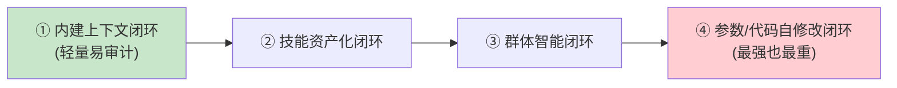
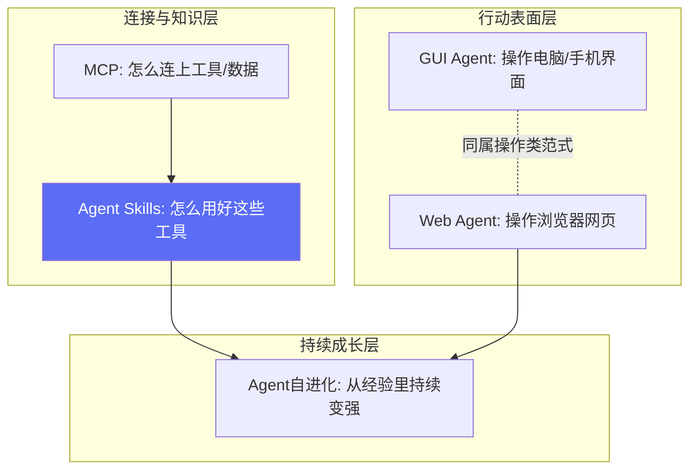

# 番外04：四个你该知道的前沿趋势——Agent Skills与MCP、GUI Agent、Web Agent、Agent自进化

> 本篇属于「番外篇」，不计入主线 6 个 Part / 23 章的编号体系。这四个话题目前还没有成熟到"值得单独开一章、配一套完整代码实战"的程度（技术都在快速变化中），但作为**认知层面的科普**，理解它们能帮你在面试、技术选型讨论、团队汇报里不露怯——这正是本篇存在的目的：不写代码，讲清楚"是什么、解决什么问题、边界在哪"。

## 01 Agent Skills 与 MCP：不是竞争关系，是分层关系

### 是什么

Anthropic 在2025年初提出的 **Agent Skills**，是一种标准化的**程序性知识封装格式**——本质是一份 `SKILL.md` 文件，里面写清楚"遇到什么场景该怎么做"。

理解这个概念最快的方式是一个类比：

| | MCP | Agent Skills |
|---|---|---|
| 解决的问题 | "能不能连上"（Connectivity） | "知不知道怎么用"（Capability） |
| 类比 | 手/USB接口——操作工具的能力 | 操作手册/SOP——怎么用这些工具完成任务 |
| 定位 | 传输层，标准化接口 | 应用层，领域知识 |

**一个真实的能力鸿沟问题**：一个Agent能连上你公司的数据库（有MCP工具），不代表它知道该怎么写一条既高效又不会误删数据的SQL——"能连接"和"会用好"是两件完全不同的事，这正是Skills要补的那一块。

### 核心机制：渐进式披露（Progressive Disclosure）

Skills 最关键的设计不是"写一份说明文档"这么简单，而是**分三层加载**，按需展开，避免一次性把所有说明书都塞进大模型的上下文：

| 层级 | 内容 | Token消耗量级 |
|---|---|---|
| 第一层：元数据 | SKILL.md的头部信息（name、description） | 约100 token/技能 |
| 第二层：技能主体 | 完整的操作说明、示例 | 1,000~5,000 token |
| 第三层：附加资源 | 脚本、参考文档、模板文件（仅真正用到时才加载） | 按需，理论无限 |

业界有真实案例：某场景直连 MCP 消耗 16,000 token 的工具Schema，用 Skills 包装后初始只消耗 500 token——**差距不是优化，是数量级的差异**。

### 产品经理该记住的判断句

> 外部服务连接（数据库/API/云服务）→ 优先用 MCP；复杂工作流/领域专业知识 → 优先用 Skills；企业级应用往往是**两者叠加的分层架构**（MCP做连接层，Skills做知识层），不是二选一。

### 边界与风险

- Skills允许执行脚本，存在代码注入风险，第三方技能的可信度目前没有统一验证机制
- 技能数量一多，元数据本身累积起来仍然会占用可观的上下文
- 不同厂商（OpenAI的Custom Instructions、Google的Grounding with Functions）对"Skills"的实现方式并不统一，还没有像MCP一样形成事实标准

---

## 02 GUI Agent：让 AI 像人一样"看屏幕、点鼠标"

### 是什么

GUI Agent 是一类能自主理解和操作图形界面的 AI 系统——通过截图"看"屏幕、通过多模态大模型"理解"界面，然后模拟点击/滑动/输入来完成任务，而不是依赖预先写好的API。

**跟传统RPA的本质区别**：

| 维度 | 传统 RPA | GUI Agent |
|---|---|---|
| 工作原理 | 固定选择器（XPath/坐标）脚本回放 | 视觉理解+语言模型推理 |
| 界面变化后 | 立刻失效，要重新录制脚本 | 有语义弹性，能适应变化 |
| 任务规划 | 人工预设每一步 | 根据自然语言指令自主拆解步骤 |

**为什么最近才爆发**：多模态大模型（GPT-4o、Claude、Qwen-VL等）第一次真正具备了"看懂界面截图并输出精确点击坐标"的能力，这在两三年前是做不到的。

### 核心机制：感知—推理—执行闭环

- **感知层**：分"结构化感知"（读DOM/Android View Hierarchy，精确但对Canvas/游戏类"黑盒"应用失效）和"纯视觉感知"（直接分析截图，通用性强但定位精度是最大挑战）两条路线。
- **推理层**：把模糊指令（"订一张高铁票"）拆解成具体操作步骤序列，很多方案会让模型先生成一段"内心独白"式分析再决策，降低出错率。
- **执行层**：动作空间是有限明确的集合（点击/滑动/输入/滚动），Android端常用ADB下发指令，桌面端常用pyautogui。

### 代表项目

阿里的 **Mobile-Agent-v3**（有在线Demo可直接体验）、智谱的 **AutoGLM**（面向手机端，支持本地部署）、字节跳动的 **UI-TARS**——这些都是2025-2026年比较活跃的开源/半开源项目，底层多依赖GPT-4o/Claude/Qwen-VL这类多模态模型。

### 边界与风险

现阶段最大的问题不是"能不能做"，而是"够不够稳"：真实场景下的任务成功率普遍只有40%~50%，长链条任务（连续10+步操作）误差会累积放大；云端调用的成本随操作步数线性增长；涉及支付、删除等高风险操作，业界共识是**必须保留人工确认环节**，不能让Agent完全自主执行。

---

## 03 Web Agent：专门针对浏览器场景的 GUI Agent

### 是什么

Web Agent 可以理解为 GUI Agent 在"浏览器"这一个特定行动表面上的专精版本——通过 DOM、可访问性树、截图的组合来感知网页，用大模型推理下一步该点哪里、填什么，在真实浏览器里执行操作。核心特征是**自主性**：区别于写死的 Playwright/Selenium 脚本，网站一改版传统脚本就失效，Web Agent 有一定的适应能力。

### 核心机制：三种感知策略，混合方案是生产环境的赢家

| 策略 | 优点 | 缺点 |
|---|---|---|
| 纯DOM解析 | 快、准 | 对Canvas渲染的SPA、Shadow DOM会失效 |
| 纯视觉（截图→模型） | 通用性强 | 成本高、容易看错小字、容易产生幻觉 |
| **混合（视觉理解布局+DOM精确定位）** | **生产环境实测成功率更高（常见业务流约90%）** | 工程复杂度更高 |

业界主流的Computer Use（Anthropic）、Operator（OpenAI）、以及托管服务商TinyFish、Browserbase，基本都走的是混合路线。

### Web场景特有的难点（这是Web Agent区别于普通GUI Agent的地方）

- **反爬机制**：Cloudflare、验证码等是硬上限——目前没有任何方案能可靠"破解"reCAPTCHA之类的人机验证，这是行业共识的天花板，不是工程能力问题。
- **会话与状态**：cookies、登录态、动态内容加载时机（判断一个XHR请求到底完没完成）比桌面GUI场景复杂得多。
- **成本**：一个10步左右的网页任务，单次调用成本大约在0.1~1美元区间，延迟约30~60秒——这决定了Web Agent目前更适合"价值高、频率不需要特别高"的任务，而不是高频调用场景。

### 产品经理该关心的一句话判断

> 如果目标网站有官方API，永远优先用API，不要用Web Agent去"模拟人操作"绕开API——这不是技术选型偏好问题，是成本和稳定性的必然选择。Web Agent真正该出场的场景，是**目标网站根本没有API、又需要自动化处理**的场景（比如监控某个没有API的电商页面价格变化）。

---

## 04 Agent 自进化（Self-Evolution）：让 Agent 能从经验里"变强"

### 是什么

自进化 Agent 是指能依据自己的**交互轨迹、任务反馈或用户纠错**，持续更新自己的记忆/技能/工作流/参数，并让这些更新真的影响未来任务表现的系统——区别于"一次性配置好就不再变"的传统Agent。

### 核心框架：四类闭环，风险与能力上限依次递增

| 类型 | 改的是什么 | 代表项目 |
|---|---|---|
| ① 内建上下文闭环 | 经验写入记忆/反思文本，不改模型参数 | Hermes Agent、Agent Zero |
| ② 技能资产化闭环 | 把"怎么做"沉淀成可评测、可版本化、可回滚的SKILL.md | Darwin Skill、EvoSkill |
| ③ 群体智能闭环 | 经验跨会话/跨用户/跨Agent共享 | Ultron、OpenSpace |
| ④ 参数/工作流自修改 | 真正改变模型策略本身 | OpenClaw-RL、Agent Lightning（微软） |

**一个值得记住的机制细节**：Darwin Skill 这类项目用了"棘轮（Ratchet）"机制——每次尝试优化后，只有**可验证地变好**才保留，否则直接回滚（`git revert`），跟做A/B测试的"只上线有效果的版本"是同一个思路。

### 产品经理该关心的核心问题：不是"能不能自进化"，是"能不能证明没变差"

原文里一个很扎心但很真实的判断：**真正限制自进化落地的，往往不是模型不够聪明，而是评估、沙箱、权限、版本治理这些工程基建不够扎实**。业界给出的实践优先级是：

> 记忆层能解决的问题，不要动技能层；技能层能解决的问题，不要动代码层；代码/工作流层能解决的问题，不要在线改模型权重。

翻译成产品语言：**自进化能力越"重"，风险越高、也越难解释给业务方"为什么Agent突然变了"**——大多数团队现阶段最该做、性价比最高的，是①②两类闭环（记忆沉淀+技能资产化），而不是一上来就想做④类的自主训练。

### 边界与风险

跨会话/跨用户共享经验（③类）需要提前设计好权限分层和隐私脱敏机制；任何允许Agent自己修改自己（脚本/技能/权重）的设计，都要考虑"技能供应链安全"——一个被污染的技能可能读取敏感路径、执行危险命令，这跟软件供应链攻击是同一类风险。

---

## 四个趋势放在一起看：它们分别在解决什么层面的问题

一句话总结四者关系：**MCP+Skills解决"Agent怎么用好工具和知识"，GUI Agent+Web Agent解决"Agent怎么操作现实世界的界面"，Agent自进化解决"这些能力能不能自己越用越好"**——它们不是互相替代的技术路线，而是同一个"更强的Agent"在不同维度上的能力拼图。

## 产品经理清单

> - [ ] 我要接的这个"工具能力"，缺的是"连接"还是"知道怎么用好"？如果是后者，别只顾着接MCP工具，还要问自己"模型知道怎么正确使用这个工具吗"。
> - [ ] 我想做的GUI/Web自动化场景，目标系统有没有官方API？如果有，永远优先用API，GUI/Web Agent是"没有API时的兜底方案"，不是首选方案。
> - [ ] 我们讨论"让Agent自进化"时，有没有先想清楚"怎么证明这次更新没让系统变差"？没有评估机制的自进化，风险大于收益。

## 章节自测（5道单选，答案见文末）

**Q1.** Agent Skills 和 MCP 的关系是什么？
A. 完全竞争、二选一　B. 分层互补关系：MCP解决"连接"，Skills解决"知道怎么用"　C. 完全一样的东西　D. Skills是MCP的替代品

**Q2.** Agent Skills 的"渐进式披露"机制核心价值是什么？
A. 让代码更好看　B. 分层按需加载，大幅降低不必要的token消耗　C. 提高安全性　D. 与token消耗无关

**Q3.** GUI Agent 相比传统RPA最本质的区别是什么？
A. 速度更快　B. 靠视觉理解+语言模型推理，界面变化时有语义弹性，而不是靠固定选择器回放脚本　C. 成本更低　D. 没有区别

**Q4.** Web Agent 场景中，验证码（如reCAPTCHA）问题目前处于什么状态？
A. 已被完全攻克　B. 是行业公认的硬上限，没有方案能可靠绕过　C. 不是问题　D. 只在中国网站存在

**Q5.** 关于Agent自进化，文中给出的实践优先级建议是什么？
A. 一开始就直接做模型参数自训练　B. 记忆层能解决的不动技能层，技能层能解决的不动代码层，代码层能解决的不在线改权重　C. 所有闭环同等优先　D. 自进化没有风险，可以随意尝试

点击查看参考答案

1-B　2-B　3-B　4-B　5-B

