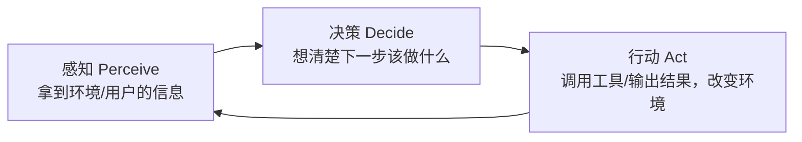

# 01 Agent 不是新物种：从自动化脚本到自主智能体的连续谱

## 一个容易被忽悠的问题

"我们这个也是 Agent 产品。" —— 这句话我在大大小小的评审会上听过太多次，但仔细一问，十次里有六次其实只是"调了个大模型 API 拼了个话术"。

这不是在挑刺。问题在于：**如果你不能准确判断自己在做的东西处于哪个技术层级，你就无法预估它的成本、风险和天花板**——这是产品经理最不该犯的错误。

所以第一件事,不是学怎么"做"Agent，是学怎么"识别"Agent。

## Agent 的本质：一个感知-决策-行动的闭环

抛开所有花哨的定义，Agent 的核心就是三件事反复循环：

区别只在于：这个循环**由谁驱动、能不能自主终止、遇到意外能不能自己调整**。这三个变量，决定了一个系统离"真正的 Agent"有多远。

## 一条连续谱，而不是一个开关

把"自主性程度"当作横轴，你会看到这样一条谱：

| 位置 | 名称 | 决策由谁做 | 遇到意外怎么办 | 典型例子 |
|---|---|---|---|---|
| 1 | 固定脚本 / RPA | 人（写死在代码里） | 报错，等人修| 定时爬虫、Excel 宏 |
| 2 | 条件流程编排 | 人预设的if-else 树 | 走预设的兜底分支 | 传统客服机器人、Dify 工作流 |
| 3 | 单轮工具调用 LLM | LLM 决定调哪个工具，但只有一步 | 直接把结果丢给用户，不会自己重试 | "帮我查下天气"类插件 |
| 4 | 自主规划循环（ReAct 等） | LLM 自己规划多步、自己判断是否结束 | 能观察结果、调整下一步 | AutoGPT 类、深度研究 Agent |
| 5 | 多智能体协作 | 多个 LLM 角色互相协商、分工 | 能通过角色间的检查互相纠错 | 多角色写作/开发团队模拟 |

**关键认知：Agent 不是"5"这个终点独有的称号，而是这条谱上"自主性明显跃升"的那一段（3~5）的统称。** 越往右走，能力上限越高，但不可控性、成本、调试难度也越高。这不是"越Agent 越好"，而是"够用就好"。

## 三个最常见的误区

**误区一："调了个 LLM API 就是 Agent"**
如果你的系统只是把用户问题拼进 prompt，让模型直接回答，中间没有"决策要不要调用工具、调用哪个、调用完要不要继续"这个环节，那它是一个"LLM 应用"，不是 Agent。差别在于**有没有自主决策的分支**。

**误区二："工作流编排 = Agent"**
Dify、Coze、n8n 这类低代码平台做出来的东西，本质是"条件流程编排"（谱上的位置 2），路径是人预先画好的，模型只是在某个节点里被调用去做判断或生成内容。这非常有用，能解决 80% 的业务场景，但它和"模型自主规划路径"是两件事，别把这两者混为一谈——这在后面 Part 2 选型的时候会很关键。

**误区三："必须多智能体协作才叫高级 Agent"**
很多团队一上来就要做"多 Agent 协作系统"，觉得这样才显得技术含量高。但多智能体协作的复杂度、调试成本、Token 消耗是单Agent 的数倍，而收益往往只在"任务确实需要多个专业角色分工"的场景才划得来。绝大多数业务问题，一个设计良好的单Agent（谱上位置 4）就足够。

## 产品经理的判断框架：三个问题定位你的产品

拿到一个"Agent 产品"需求时，先别急着讨论技术方案，先问自己三个问题：

1. **这个系统需要自己决定"要不要调用工具、调用几次"吗？**
   - 不需要（人/规则已经决定好路径）→ 你在做的是流程自动化，别叫它 Agent，用更便宜的方案。
   - 需要 → 至少是位置 3 起步。

2. **它需要在多个步骤之间自主判断"任务是否完成"吗？**
   - 不需要（一步到位或人工确认结束）→ 停在位置 3 就够，别过度设计。
   - 需要（比如"研究清楚一个问题"这种模糊终点的任务）→ 需要位置 4 的自主规划循环。

3. **任务是否天然需要多个不同专业角色分工协作，且单一角色扛不住？**
   - 不是 → 别做多智能体，先把单 Agent 做扎实。
   - 是（比如"既要写代码又要做代码审查还要写测试"）→ 才考虑位置 5。

> **产品经理清单**
> - [ ] 我能用一句话说清楚，我的产品在"感知-决策-行动"循环里，哪一步是模型自主决定的？
> - [ ] 我是否因为"显得技术含量高"而选择了比实际需要更复杂的方案？
> - [ ] 如果把它降级成流程编排（Dify/Coze 那种），会损失掉产品的核心价值吗？如果不会，那就不该用 Agent。

## 小结

Agent 不是一个新物种，是自动化能力谱系上"模型开始拥有自主决策权"之后的那一段。判断一个系统是不是 Agent、该做到多"Agent"，不看它用了什么框架，看它的决策权到底在谁手里。

下一章，我们把镜头拉远，看看这条连续谱是怎么一步步被"逼"出来的——从符号主义到 LLM 驱动，每一代技术范式的兴衰都有清晰的逻辑。
