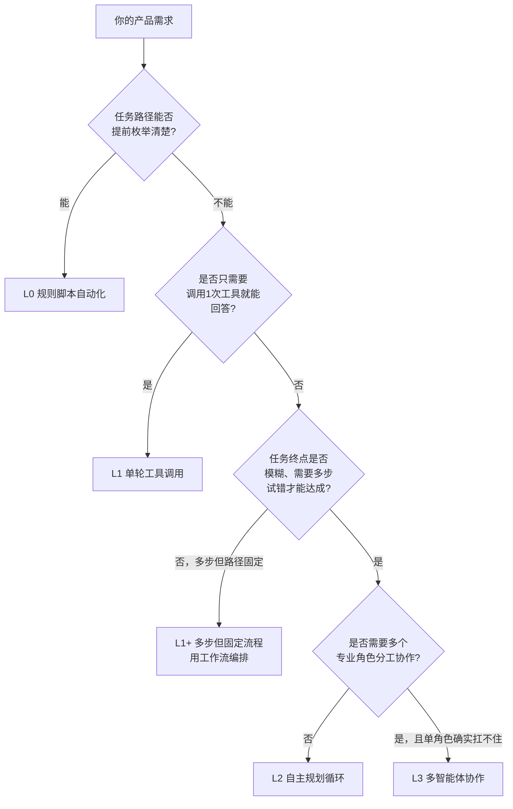

# 04 Agent 产品成熟度分级：L0~L3

## 为什么需要一个分级框架

"我们要不要做 Agent" 这个问题本身是个假问题——真正该问的是"我们的产品需要做到哪一级的自主性"。这一章给出一个我在真实项目里反复验证过的原创分级框架，帮你把模糊的"要不要做 Agent"，变成清晰的"该做到 L 几"。

## L0～L3 分级总览

### L0：规则脚本自动化 —— "有手没脑子"

- **定义**：路径完全固定，没有任何模型参与决策，纯代码/规则驱动。
- **例子**：定时任务、RPA 按钮点击脚本、IFTTT 式触发器。
- **何时够用**：任务路径能被100% 枚举，且几乎不会有例外分支。
- **常见错误**：给这类需求硬套上"Agent"的名头去立项——本质是消耗了远超需求的复杂度预算。

### L1：单轮工具调用 —— "有手，脑子转一下就完事"

- **定义**：模型根据用户输入判断该调用哪个工具、传什么参数，调用一次拿到结果就结束，不会自己判断"要不要再来一轮"。
- **例子**：简单客服机器人（"查一下我的订单状态"→调用1个查询 API →直接回答）。
- **何时够用**：任务边界清晰、一次工具调用基本能覆盖需求。
- **风险点**：如果实际任务经常需要"查完A发现要再查 B"，但系统只会调一次，用户体验会很差——这是判断该不该升级到 L2 的关键信号。

> 这一级里还有一个常被误认为"更高级"的变体——**多步但路径固定的工作流编排**（Dify/Coze/n8n 里搭的那种流程）。它确实能处理多步任务，但每一步"下一步走哪"是人预先画好的，不是模型自主判断的，所以本质仍属于"L1 家族"，只是流程比单轮复杂。这类方案性价比极高，能解决大部分业务场景，Part 2 第06 章会专门讲怎么选。

### L2：自主规划循环 —— "有手有脑子，会自己试错"

- **定义**：模型自己规划多个步骤、观察每一步结果、判断任务是否完成、决定下一步该做什么（典型代表：ReAct 循环）。
- **例子**：深度研究类 Agent（"帮我调研清楚这个行业的竞争格局"——需要搜索、读取、总结、判断信息是否足够、可能要再搜索几轮）。
- **何时需要**：任务终点本身是模糊的，需要"边做边判断还差什么"，无法提前把步骤写死。
- **代价**：不可控性上升（可能陷入循环、可能过早认为任务完成）、Token 消耗上升（每一步都要重新把上下文喂给模型）、调试难度上升（出错时很难复现具体是哪一步的判断错了）。
- **必须配套的护栏**：最大步数限制、关键动作的二次确认、结果的可追溯校验（呼应第03 章讲的幻觉风险）。

### L3：多智能体协作 —— "一个团队，而不是一个人"

- **定义**：多个具备不同角色/工具/上下文的 Agent 相互通信、分工协作完成任务，通常有一个协调者（Orchestrator）负责调度。
- **例子**：一个"角色分工的开发小组"模拟——一个 Agent 负责写代码、一个负责代码审查、一个负责写测试，互相检查纠错。
- **何时真的需要**：任务天然需要多个专业视角交叉验证，且证明单一Agent 在这个任务上反复尝试后依然扛不住（比如上下文太长导致单Agent 顾此失彼、或任务确实需要强制的"角色隔离"来保证输出质量）。
- **最大的坑——过度设计陷阱**：多智能体协作的 Token 成本、延迟、失败模式的复杂度，往往是单 Agent 的 3~5 倍。很多团队在 L2 都没做扎实的情况下就跳到 L3，指望"多找几个 Agent 互相纠错"来弥补单点能力不足，结果是复杂度爆炸、成本失控，效果反而不如一个打磨扎实的单 Agent。**先把 L2 做到位，是做 L3 的前提，不是可以跳过的步骤。**

## 分级对照速查表

| | L0 规则脚本 | L1 单轮工具调用 | L2 自主规划循环 | L3 多智能体协作 |
|---|---|---|---|---|
| 决策者 | 人/规则 | 模型（单步） | 模型（多步自主） | 多个模型角色 |
| 路径是否预先确定 | 完全确定 | 基本确定 | 不确定，边做边定 | 不确定，且分角色 |
| 典型开发方式 | 纯代码 | 函数调用/Function Calling | ReAct/Plan-and-Solve 循环 | Multi-Agent 框架（如AutoGen） |
| 调试难度 | 低 | 低 | 中高 | 高 |
| Token/成本 | 几乎无 LLM 成本 | 低 | 中高（多轮） | 高（多个 Agent 并行/串行调用） |
| 该在什么阶段引入 | 需求确定不变 | MVP 起步的默认选择 | 验证 L1 无法满足后再升级 | 验证 L2 单 Agent 确实扛不住后再升级 |

## 升级到下一级之前，问自己这几个问题

> **产品经理清单**
> - [ ] 我是否已经验证了"当前级别真的不够用"，还是只是主观觉得"应该做得更高级"？
> - [ ] 升一级的边际收益（体验提升）和边际成本（Token/延迟/可控性下降）算过账了吗？
> - [ ] 如果要升级到 L2，我给自主循环设计的护栏（最大步数、结果校验）是什么？
> - [ ] 如果要升级到 L3，我能不能明确说出"哪个具体角色分工是单Agent 顾不过来的"？说不出来就别升。

## 小结

Part 1 到这里就结束了。回顾一下我们建立的四个认知：Agent 是连续谱不是开关（01）、每代技术范式的兴衰都有清晰逻辑（02）、大模型的能力边界直接决定设计选择（03）、以及一套可以直接拿去用的分级框架（04）。

从下一Part 开始，我们正式动手——先手把手实现三大经典范式（ReAct/Plan-and-Solve/Reflection），这部分的第一个可运行 demo 已经提前发布在 [`demos/01-hello-react-agent`](../../demos/01-hello-react-agent)，欢迎先跑起来玩一玩。
