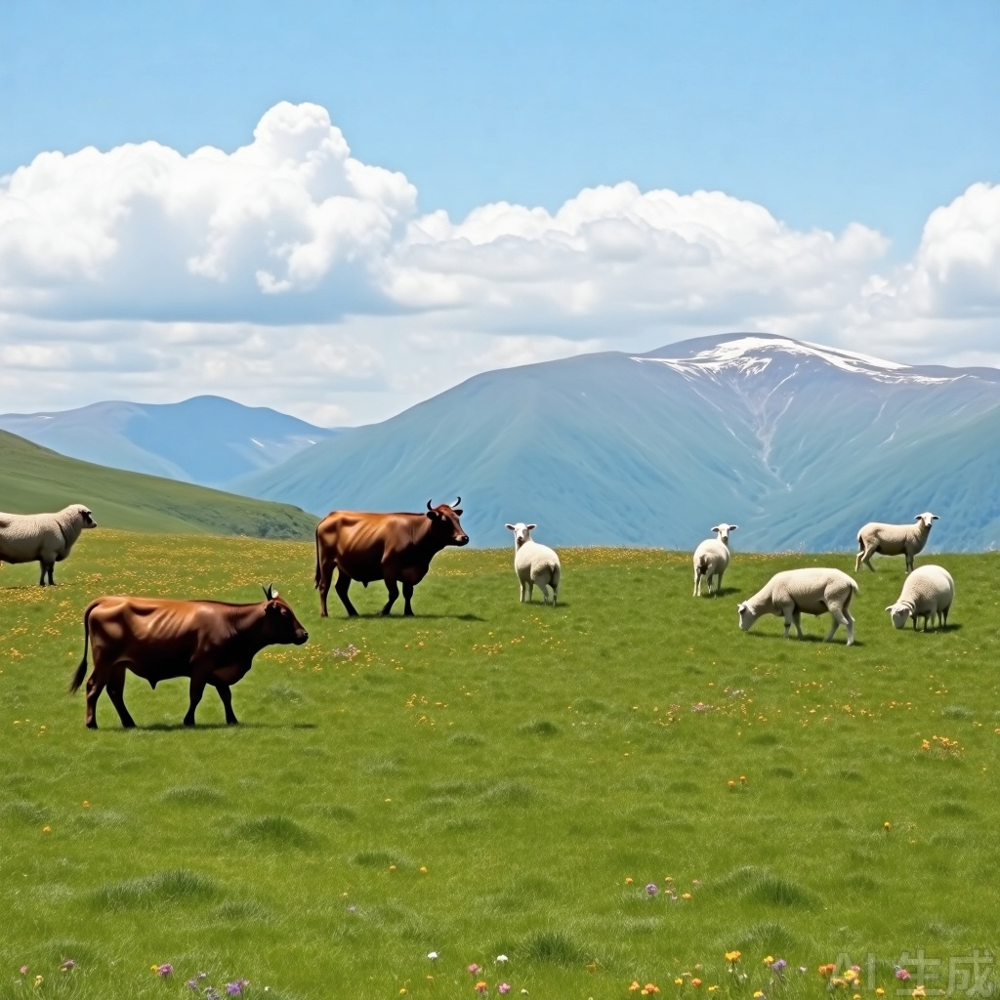

# Part 1 · 认知重建

> 别急着学怎么写代码。先把"Agent 到底是什么"这件事想清楚，否则你搭出来的东西自己都说不清是不是 Agent。

本Part 共4 章，读完你会获得：

- 一套判断"这到底是不是 Agent"的三问框架
- 一张 Agent 技术范式演进的全景图，理解"为什么现在轮到 LLM 驱动的 Agent 了"
- 对大模型能力边界的产品级理解，知道它的局限会怎样倒逼你的产品设计
- 一个原创的 **Agent 产品成熟度分级（L0~L3）**，用来给自己或别人的产品"定级"

| 章节 | 标题 | 一句话 |
|---|---|---|
| 01 | [Agent 不是新物种](./01-Agent不是新物种.md) | Agent 是一条连续谱，不是有或没有的开关 |
| 02 | [一张图看懂 Agent 进化史](./02-一张图看懂Agent进化史.md) | 每一代技术范式都是被上一代的局限逼出来的 |
| 03 | [大模型是发动机不是车](./03-大模型是发动机不是车.md) | 别用参数表选模型，用产品场景选模型 |
| 04 | [Agent 产品成熟度分级](./04-Agent产品成熟度分级.md) | L0~L3，先想清楚你到底需要造到哪一级 |
