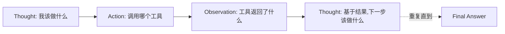
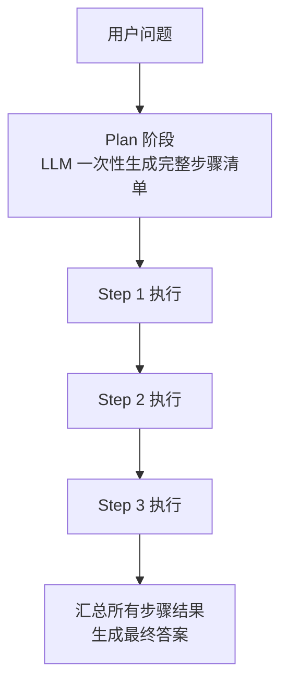
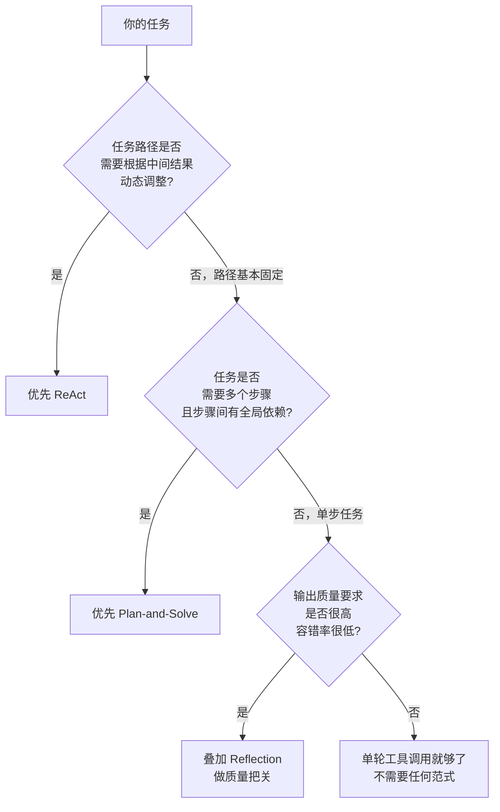

# 05 三大经典范式手把手实现：ReAct / Plan-and-Solve / Reflection

## 为什么是这三个，不是别的

市面上讲"Agent范式"的文章列了十几种名字，让人眼花。但如果你只关心"能实际解决问题、值得亲手实现一遍"的范式，收敛到底就是三个——它们分别解决"Agent 循环里最容易出问题的那一环"：

| 范式 | 解决的核心问题 |
|---|---|
| **ReAct** | 怎么让模型一边想一边做，而不是先把话说完再执行 |
| **Plan-and-Solve** | 怎么避免"走一步看一步"导致的短视/绕路 |
| **Reflection** | 怎么让模型自己发现并修正自己的错误 |

这一章我们把三个都手写实现一遍（不借助任何 Agent 框架），配套代码在 [`demos/`](../../demos) 目录，跑起来比看文字理解得快十倍。

## 范式一：ReAct（Reasoning + Acting）—— 边想边做

### 核心机制

上一Part 我们已经在 [`demos/01-hello-react-agent`](../../demos/01-hello-react-agent) 里手写了一个完整实现，这里回顾核心循环：



关键在于：**模型每一步的决策，都建立在上一步真实的执行结果之上**，而不是在开头就把所有步骤想好。这是 ReAct 相较于"一次性列清单"最大的优势——**它能根据中间结果动态调整路径**。

### ReAct 的代价：短视问题

正因为"边想边做"，ReAct 容易掉进一个陷阱：**每一步都只看眼前最优，缺少全局规划**，导致明明有更高效的路径，模型却按局部最优的思路绕了远路。举个例子：

> 任务："帮我查一下今天的汇率，然后算出100美元换算成人民币和日元各是多少，再告诉我哪个换算路径最划算。"

一个短视的 ReAct 循环可能会：先查美元兑人民币汇率→算出人民币金额→再单独去查美元兑日元汇率→算出日元金额——而没有意识到"最后一步比较划算"这个目标其实需要提前统一规划好要查哪几个汇率，一次性查完再统一计算，而不是查一个算一个再查下一个。

这就是Plan-and-Solve 要解决的问题。

## 范式二：Plan-and-Solve —— 先想清楚全局路径，再执行

### 核心机制

Plan-and-Solve 把"规划"和"执行"拆成两个明确分离的阶段：



和 ReAct 最大的区别：**Plan 阶段模型看到的是完整任务，会做全局规划；Solve 阶段按计划逐条执行，通常不再重新规划路径**（除非某一步失败需要重新规划，这是进阶版才会加的容错机制）。

### 最小实现

```python
# demos/02-plan-and-solve-agent/plan_and_solve_agent.py 核心逻辑（完整代码见对应目录）

def make_plan(question: str, client, model) -> list[str]:
    """Plan 阶段：让模型一次性把任务拆解成有序步骤清单"""
    resp = client.chat.completions.create(
        model=model,
        messages=[
            {"role": "system", "content": (
                "你是任务规划专家。把用户问题拆解成一个有序的步骤清单，"
                "每一步应该是一个明确的、可独立执行的子任务。"
                "只输出步骤清单，每行一个步骤，不要输出多余内容。"
            )},
            {"role": "user", "content": question},
        ],
        temperature=0,
    )
    steps = [line.strip() for line in resp.choices[0].message.content.splitlines() if line.strip()]
    return steps


def solve_steps(steps: list[str], client, model, tools: dict) -> list[str]:
    """Solve 阶段：按计划逐条执行，每一步可以调用工具"""
    results = []
    for i, step in enumerate(steps, 1):
        # 这里每一步依然可以是一个mini ReAct（调工具→拿结果），
        # 但不会像纯ReAct那样"重新规划全局路径"
        resp = client.chat.completions.create(
            model=model,
            messages=[
                {"role": "system", "content": f"可用工具：{list(tools.keys())}。执行下面这个具体步骤，如需调用工具请说明工具名和输入，否则直接给出结果。"},
                {"role": "user", "content": f"步骤{i}: {step}\n之前步骤的结果：{results}"},
            ],
        )
        results.append(resp.choices[0].message.content)
    return results
```

（完整可运行版本，包括工具调用解析和最终汇总，见 [`demos/02-plan-and-solve-agent`](../../demos/02-plan-and-solve-agent)。）

### Plan-and-Solve 的代价：计划可能是错的，而且不会自我修正

Plan-and-Solve 用"全局规划"换来了路径效率，但代价是：**如果 Plan 阶段生成的计划本身有问题（比如漏了一步、顺序错了），Solve 阶段会忠实地执行一个错误的计划，而不会像 ReAct 一样走一步发现问题就调整。**

这就是为什么很多生产级实现会把ReAct 和 Plan-and-Solve 结合：**先Plan 生成大致路径，再用 ReAct 的方式执行每一步、允许中途重新规划**——这是目前工程实践里最常见的混合方案。

## 范式三：Reflection —— 自己当自己的审稿人

### 核心机制

ReAct 和 Plan-and-Solve 解决的是"怎么把任务做完"，Reflection 解决的是另一个问题：**怎么让输出质量更高**。核心机制是让模型在两个角色之间来回切换：

```mermaid
graph LR
    G[Generator生成初稿] --> C[Critic 批评者<br/>找茬:哪里不对/不够好]
    C --> D{批评意见<br/>严重吗?}
    D --乐观|通过| Done[输出最终结果]
    D --不通过--> R[Generator 根据批评<br/>修正]
    R --> C
```

### 最小实现

```python
# demos/03-reflection-agent/reflection_agent.py 核心逻辑

def generate(task: str, feedback: str, client, model) -> str:
    prompt = task if not feedback else f"{task}\n\n上一版收到的批评意见：{feedback}\n请针对这些问题修正后重新输出完整结果。"
    resp = client.chat.completions.create(
        model=model,
        messages=[{"role": "user", "content": prompt}],
    )
    return resp.choices[0].message.content


def critique(task: str, draft: str, client, model) -> str:
    resp = client.chat.completions.create(
        model=model,
        messages=[
            {"role": "system", "content": (
                "你是一个严格的审稿人。检查下面这份针对任务的输出，"
                "找出事实错误、逻辑漏洞、遗漏的要求。"
                "如果完全没问题，只回复'通过'；否则列出具体问题。"
            )},
            {"role": "user", "content": f"任务：{task}\n\n输出：{draft}"},
        ],
    )
    return resp.choices[0].message.content


def run_reflection(task: str, client, model, max_rounds: int = 3) -> str:
    draft = generate(task, "", client, model)
    for round_i in range(max_rounds):
        feedback = critique(task, draft, client, model)
        if "通过" in feedback[:10]:  # 简单判定，生产环境建议用结构化输出替代
            break
        draft = generate(task, feedback, client, model)
    return draft
```

（完整版本见 [`demos/03-reflection-agent`](../../demos/03-reflection-agent)。）

### Reflection 的代价：成本翻倍，且"自己批评自己"有天花板

Reflection 至少要多花一倍的 Token 和延迟（每一轮都要生成+批评两次调用），而且存在一个根本性局限：**如果模型本身就不具备判断某类错误的能力，它当"审稿人"时同样发现不了这个错误**——比如模型本身有的知识盲区，生成阶段会犯错，批评阶段大概率也发现不了。Reflection 能显著提升"格式规范性、逻辑连贯性、明显的遗漏"这类问题，但不能指望它把幻觉问题连根拔起。

## 三种范式怎么选：决策框架



三者也常常组合使用，一个成熟的生产级 Agent 往往是**"Plan-and-Solve 定大方向 + 每个子步骤内部用ReAct 执行 + 关键输出前叠加一层Reflection 把关"**——这不是理论上的组合，是我在真实项目（Part 4 会讲到的数据分析 Agent）里实际验证过的架构模式。

## 产品经理清单

> - [ ] 我的任务是否真的需要"边做边调整路径"？如果路径基本确定，直接上 Plan-and-Solve 会比 ReAct 更省成本、更好调试。
> - [ ] 如果用 Plan-and-Solve，我有没有考虑"计划本身出错"的情况？要不要在关键步骤失败时允许重新规划？
> - [ ] 我的场景对输出质量的容错率有多低？值不值得为Reflection 多花一倍的 Token 成本？
> - [ ] 我是不是把三种范式当成"三选一"，而没有考虑组合使用的可能性？

下一章，我们从"怎么实现范式"切换到"怎么选平台"——聊聊 Dify、Coze、n8n 这些低代码平台，什么时候该用它们，什么时候不该用。

## 章节自测（5道单选，答案见文末）

**Q1.** ReAct 范式最大的优势是什么？
A. 成本最低　B. 能根据中间结果动态调整路径　C. 不需要工具　D. 一定比 Plan-and-Solve 快

**Q2.** ReAct 容易掉入的陷阱是什么？
A. 幻觉　B. 短视问题——每步只看眼前最优，缺少全局规划导致绕远路　C. 过拟合　D. 内存泄漏

**Q3.** Plan-and-Solve 的代价是什么？
A. 成本一定更高　B. 如果 Plan 阶段计划本身有问题，Solve 阶段会忠实执行错误计划　C. 不能调用工具　D. 只能单步

**Q4.** Reflection 范式解决的核心问题是什么？
A. 怎么把任务做完　B. 怎么让输出质量更高，通过生成者和批评者角色来回修正　C. 怎么省钱　D. 怎么加速推理

**Q5.** 文中提到的生产级 Agent 常见组合架构是什么？
A. 只用 ReAct　B. Plan-and-Solve 定大方向+子步骤内部ReAct执行+关键输出前叠加Reflection把关　C. 只用 Reflection　D. 三者不能组合

<details>
<summary>点击查看参考答案</summary>

1-B　2-B　3-B　4-B　5-B

</details>
