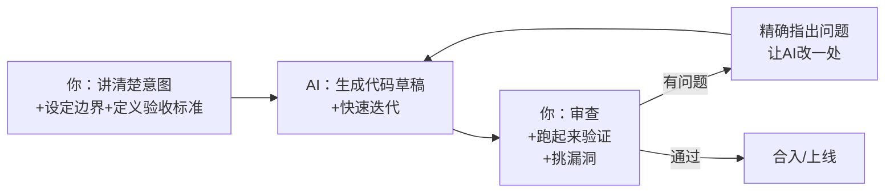

# 06 Vibecoding方法论：怎么用AI编程工具把Agent产品做出来

## 先说清楚一个正在发生的事实：手写代码不再是造轮子的默认方式

上一章讲了三大经典范式的手写实现，那是为了让你看清楚 ReAct/Plan-and-Solve/Reflection 循环内部到底在做什么。但"看清楚原理"和"这份代码怎么产出"，从 2026 年往后看，已经是两件可以分开的事——**现实中几乎没有人再逐行手敲这些代码了，包括工程师**。真实的做法是：跟一个 AI 编程工具（Cursor / CodeBuddy / Claude Code 之类）协作把代码写出来，人负责把意图讲清楚、审查产出对不对、在关键节点做判断。这个协作方式，业内通称 **Vibecoding**。

这对这门课的核心读者（转型 AI 产品经理的人）反而是好消息：**手写代码的门槛消失了，但"审查 AI 写的代码是不是真的对"这个门槛升高了**——而后者恰好更接近产品经理的天然能力（判断力、找漏洞、抓边界情况），不是纯语法记忆。这本书从第一章就强调"讲判断力、不是讲语法"，Vibecoding 不是对这个立场的偏离，而是它最自然的延伸：连"写"这件事本身，现在也变成了一种需要判断力的协作，而不是纯体力活。

## Vibecoding 不是"让 AI 全权代劳"，是一种新的协作分工

很多人对 Vibecoding 有个误解：以为就是"把需求甩给 AI，然后祈祷它写对"。这是最容易踩坑的用法。真正靠谱的分工是这样的：



这条循环里，**你唯一不能外包的两件事，是"讲清楚意图"和"审查产出"**——中间"生成代码"这一步交给 AI 完全没问题，但如果你连验收标准都讲不清楚、审查时也看不出问题在哪，这条循环就会失控：AI 会很自信地写出一份"看起来能跑、但藏着坑"的代码，而你没有能力发现。

## 怎么把意图讲清楚：Agent 代码的 Prompt 策略

给 AI 编程工具下需求，跟给 Agent 本身写 System Prompt，遵循的是同一套底层逻辑（回顾第05章的结构化约束思路）——越具体、越有验收标准，产出质量越高。针对"让 AI 帮你写 Agent 代码"这个场景，有三个专门的技巧：

1. **先讲清楚"这是第几层复杂度"，再讲需求**：直接说"帮我写一个 Agent"，AI 大概率会默认套用它见过最多的重型模式（多 Agent、复杂状态图），哪怕你的场景只需要一个单轮工具调用。明确告诉它"这是 L1 单轮工具调用场景，不需要多轮循环"（对应第01章的成熟度分级），能显著减少过度设计。
2. **明确列出"必须有的护栏"，不要假设 AI 会主动加**：最大步数限制、工具调用失败的兜底、超时保护——这些 AI 默认不一定会主动加（尤其是你只说"写一个能调用工具的 Agent"这种模糊需求时）。把这些护栏写进第一版需求里，比事后审查发现漏了再补，效率高得多。
3. **给一个"验收标准"而不是"实现方式"**：与其说"用 while 循环实现"，更好的说法是"输入一个数学问题，最多循环6轮，超过就返回'已达最大步数'"——描述你要的结果和边界，让 AI 自己决定怎么实现，你审查时只要对着验收标准检查，不需要纠结实现细节是否跟你想的一模一样。

## Review Checklist：AI 写的 Agent 代码，这五处最容易藏坑

这份清单来自我自己用 AI 工具协作写这门课好几个 demo 时真实踩过的坑（包括 [Demo08](../../demos/08-langgraph-prd-review/README.md) 用 LangGraph 那个案例，第一版 AI 生成的代码里就漏了轮数上限，人工审查加回去的）：

| 检查项 | 为什么容易被 AI 漏掉 | 怎么发现 |
|---|---|---|
| **有没有最大步数/轮数限制** | AI 默认关注"逻辑对不对"，不天然联想到"如果模型一直不给终止信号会怎样" | 直接问自己："如果模型永远不输出 Final Answer，这段代码会不会死循环？" |
| **工具调用失败了怎么办** | Demo级代码AI 习惯假设"调用总会成功"，只写 happy path | 故意让某个工具函数抛异常，看整个流程是崩溃退出还是能优雅处理 |
| **有没有过度设计** | AI 训练数据里"高级方案"的样本远比"够用就好的极简方案"多，容易不问场景就上状态图/多Agent | 回头看第一章"这是第几层复杂度"的判断——如果实际是L1场景，AI给了L3的架构，那就是过度设计 |
| **有没有安全隐患（比如直接 `eval` 用户输入）** | AI 为了"让 Demo 快速跑起来"，经常抄近路用不安全的实现（`eval`/字符串拼接SQL等） | 搜索代码里有没有 `eval`、`exec`、字符串拼接的 SQL/Shell 命令这几个高危信号词 |
| **System Prompt 有没有被写死在业务代码深处，改起来要翻好几层** | AI 倾向把能跑起来的代码堆在一起，不会主动做"配置和逻辑分离"这种工程习惯 | 问自己："如果我想改一句 Prompt 措辞，需要去改几个文件？" 超过1个就该重构 |

**这份清单的本质，是把"经验丰富的工程师会本能检查的东西"显性化成一份普通人也能照着做的清单**——你不需要有十年编程经验才能审查代码，你需要的是知道该往哪五个方向看。

## 一段真实的 Vibecoding 会话记录（节选自 Demo08 的真实产出过程）

比起空谈方法论，看一段真实过程更直观。做 [Demo08：LangGraph PRD 评审流水线](../../demos/08-langgraph-prd-review/README.md) 时，实际的协作过程大致是：

```
我：帮我写一个用LangGraph实现的三分支评审流程：产品经理写PRD→评审官判断
    通过/小修/需升级架构师三选一→需要时架构师介入给反馈→打回产品经理修订→
    重新评审。要求：升级架构师这条分支最多只能触发一次，不能反复升级。

AI：（生成了第一版代码，状态图节点、条件边都对，但升级次数没有做限制——
    如果评审官反复判"需升级"，会无限次调用架构师）

我：检查了一下"最多只能触发一次"这个要求有没有实现——发现state里没有
    "是否已升级过"这个标记位，加一个 escalated: bool 字段，路由函数里
    判断如果已经escalated过就不再走升级分支，直接走小修。

AI：（补上了这个字段和判断逻辑，重新生成路由函数）

我：跑一遍测试用例，故意让评审官连续两次判"需升级"，确认第二次真的
    被拦截转向小修分支，而不是又调用了一次架构师。
```

这段对话对应的正是上面清单里的第一条（护栏容易被漏）——**AI 第一版代码"逻辑看起来是对的"，但没有主动检查我提的一个具体约束条件是否真的被满足，需要我自己带着这个约束去逐条核对**。这就是"审查"这一步真正在做的事：不是重新写一遍代码，而是拿着验收标准，一条一条对答案。

## 什么时候 Vibecoding 不够用，还是需要你自己啃一遍底层原理

Vibecoding 大幅降低了"写出来"的门槛，但不代表所有场景都可以跳过"理解原理"这一步：

```mermaid
flowchart TD
    Start[准备用AI写一段Agent代码] --> Q1{这段代码的正确性<br/>能靠跑测试用例<br/>完全验证吗?}
    Q1 --能--> Vibe[放心Vibecoding<br/>+跑测试用例验证]
    Q1 --不能，比如涉及安全/<br/>成本控制/并发这类<br/>非功能性要求--> Q2{你自己懂不懂<br/>这类问题该看什么?}
    Q2 --懂，知道该往哪审查--> Vibe2[Vibecoding<br/>+针对性人工审查]
    Q2 --不懂，连该看哪都不知道--> Learn[先补一点原理<br/>知道"该往哪个方向审查"<br/>再回来Vibecoding]
```

这也是为什么这门课接下来两章（07 低代码平台怎么选、08 主流框架产品化评测）以及第09章的"从零手写"依然保留——**它们的价值不是让你以后手敲这些代码，是让你知道"AI 写出来的东西，该往哪几个方向审查才靠谱"。理解原理和用 AI 写代码，从来不是二选一，是"理解原理决定你审查的深度，Vibecoding 决定你产出的速度"。**

## 产品经理清单

> - [ ] 我给 AI 编程工具下需求时，有没有讲清楚"这是第几层复杂度"和"必须有的护栏"，还是只给了一句模糊的功能描述？
> - [ ] AI 写完之后，我是"看起来能跑就合入"，还是真的拿着上面五项检查清单过了一遍？
> - [ ] 遇到 AI 给的方案感觉"有点大"的时候，我有没有能力判断这是不是过度设计，还是我自己也说不清楚"够用的方案该是什么样"？

> 想看这套方法论在真实项目里具体怎么用的完整对话记录吗？回头看 [Demo08 的 README](../../demos/08-langgraph-prd-review/README.md)，里面详细讲了"这个场景为什么真的需要框架"的判断过程，也是一次真实的人机协作产出记录。

下一章，我们讨论另一个关于"该不该自己写代码"的维度——什么时候该用低代码平台（Dify/Coze/n8n），而不是无论用不用 AI 辅助，都要自己维护一套代码。

## 章节自测（5道单选，答案见文末）

**Q1.** 文中对 Vibecoding 协作分工的核心观点是什么？
A. 把所有事都交给 AI　B. 你唯一不能外包的是"讲清楚意图"和"审查产出"，中间生成代码可以交给AI　C. 完全不能用AI写代码　D. 只有工程师才能用AI写代码

**Q2.** 给 AI 编程工具下需求时，三个专门技巧**不包括**哪一项？
A. 先讲清楚这是第几层复杂度　B. 明确列出必须有的护栏　C. 给验收标准而不是具体实现方式　D. 要求AI必须用面向对象写法

**Q3.** Review Checklist 里，"过度设计"这一项容易被漏掉的原因是什么？
A. AI故意为难用户　B. AI训练数据里高级方案样本远比极简方案多，不问场景容易上重型架构　C. 过度设计更省代码量　D. 跟场景复杂度无关

**Q4.** 文中那段Demo08真实会话记录，暴露的问题属于清单里哪一项？
A. 安全隐患　B. 护栏（步数/轮数限制）容易被漏掉　C. Prompt写死在业务代码里　D. 过度设计

**Q5.** 关于"要不要理解底层原理"，文中的判断依据是什么？
A. 任何情况都不需要理解原理　B. 正确性能否靠测试用例完全验证；涉及安全/成本/并发等非功能性要求时，需要知道该往哪审查　C. 任何情况都必须先手写一遍　D. 只要用AI写就不用管对不对

<details>
<summary>点击查看参考答案</summary>

1-B　2-D　3-B　4-B　5-B

</details>
