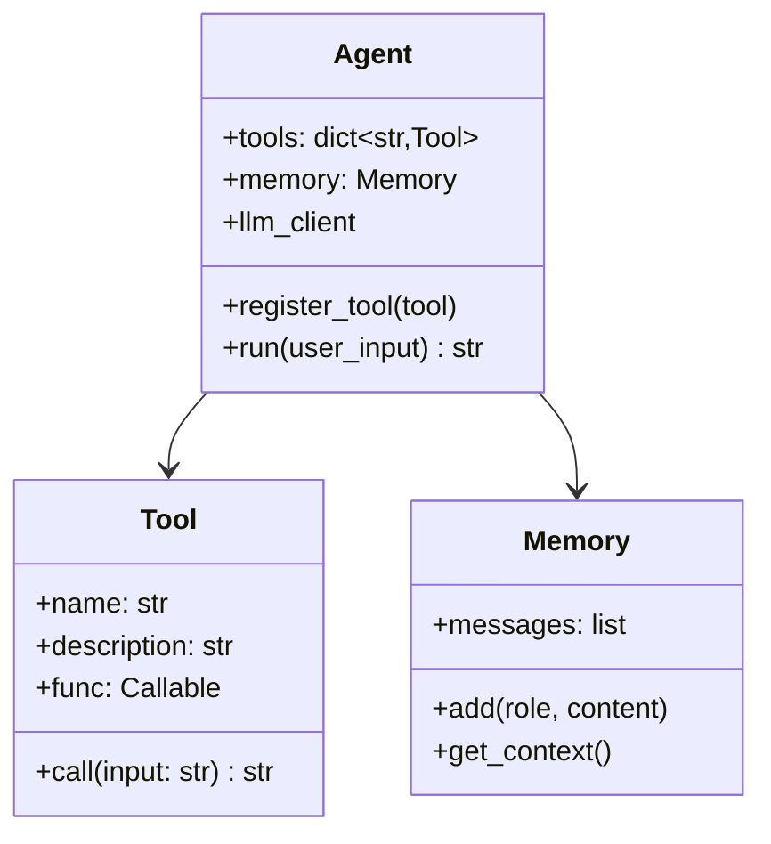

# 08 从零写一个 <300 行的 Agent 框架

## 为什么要亲手写一遍

上一章说"很多场景不需要框架"，但这不代表"框架的设计思想不重要"——恰恰相反，**理解一个最小可用框架该怎么设计，是判断"我到底需不需要引入 LangGraph/AutoGen 这类重型框架"的前提**。这一章我们从零实现一个不到300行的迷你Agent 框架，覆盖工具注册、ReAct 循环、基础记忆三个核心能力，完整代码见 [`demos/04-mini-agent-framework`](../../demos/04-mini-agent-framework)。

## 设计目标：只做三件事，但做扎实

一个最小可用的Agent 框架，本质要解决三个问题：

1. **工具怎么注册、怎么让模型知道有哪些工具可用**（工具系统）
2. **模型的决策循环怎么驱动**（执行引擎，比如ReAct 循环）
3. **多轮对话之间怎么维持上下文**（记忆，哪怕是最简单的"历史消息列表"）

我们故意**不**做的事：多智能体协作、复杂状态图、分布式部署——这些是"框架的框架"该解决的问题（对应 LangGraph/AutoGen 那一层），一个最小框架的价值在于把最核心的抽象做干净。

## 核心抽象设计



三个类分工清晰：`Tool` 只负责"怎么执行一个具体动作"，`Memory` 只负责"记住聊过什么"，`Agent` 负责把两者粘合起来驱动决策循环。**这种分层是所有Agent 框架的通用骨架**——LangGraph/AutoGen 本质上也是在这个骨架上叠加了更复杂的编排能力。

## 核心代码（节选，完整版见demo 目录）

```python
# demos/04-mini-agent-framework/mini_agent/core.py

from dataclasses import dataclass, field
from typing import Callable
import re


@dataclass
class Tool:
    name: str
    description: str
    func: Callable[[str], str]

    def call(self, input_str: str) -> str:
        try:
            return self.func(input_str)
        except Exception as e:  # noqa: BLE001
            return f"工具执行出错: {e}"


class Memory:
    """最简单的记忆实现：一个消息列表。生产环境可以替换成向量检索版本，
    但对外接口（add/get_context）保持不变——这是框架设计的关键:
    上层Agent逻辑不应该关心记忆内部怎么实现。"""

    def __init__(self, max_turns: int = 20):
        self.messages: list[dict] = []
        self.max_turns = max_turns

    def add(self, role: str, content: str):
        self.messages.append({"role": role, "content": content})
        if len(self.messages) > self.max_turns * 2:
            self.messages = self.messages[-self.max_turns * 2:]

    def get_context(self) -> list[dict]:
        return self.messages.copy()


class Agent:
    def __init__(self, llm_client, model: str, system_prompt: str = "", max_steps: int = 6):
        self.llm_client = llm_client
        self.model = model
        self.system_prompt = system_prompt
        self.max_steps = max_steps
        self.tools: dict[str, Tool] = {}
        self.memory = Memory()

    def register_tool(self, tool: Tool):
        self.tools[tool.name] = tool

    def _build_system_prompt(self) -> str:
        tools_desc = "\n".join(f"- {t.name}: {t.description}" for t in self.tools.values())
        return (
            f"{self.system_prompt}\n\n可用工具：\n{tools_desc}\n\n"
            "按以下格式输出：\nThought: ...\nAction: 工具名\nAction Input: 输入\n"
            "或者直接：\nThought: ...\nFinal Answer: 最终答案"
        )

    def _parse(self, text: str):
        final = re.search(r"Final Answer:\s*(.*)", text, re.DOTALL)
        if final:
            return "final", final.group(1).strip()
        action = re.search(r"Action:\s*(\w+)", text)
        action_input = re.search(r"Action Input:\s*(.*)", text, re.DOTALL)
        if action and action_input:
            return action.group(1).strip(), action_input.group(1).strip().splitlines()[0]
        return None, None

    def run(self, user_input: str) -> str:
        self.memory.add("user", user_input)
        messages = [{"role": "system", "content": self._build_system_prompt()}] + self.memory.get_context()

        for _ in range(self.max_steps):
            resp = self.llm_client.chat.completions.create(
                model=self.model, messages=messages, temperature=0, stop=["Observation:"],
            )
            content = resp.choices[0].message.content
            action, action_input = self._parse(content)
            messages.append({"role": "assistant", "content": content})

            if action == "final":
                self.memory.add("assistant", action_input)
                return action_input

            tool = self.tools.get(action)
            observation = tool.call(action_input) if tool else f"未知工具: {action}"
            messages.append({"role": "user", "content": f"Observation: {observation}"})

        return "已达到最大步数限制。"
```

## 用它重新实现第01章的Demo，看代码量差多少

```python
# demos/04-mini-agent-framework/example_usage.py

from mini_agent.core import Agent, Tool
from openai import OpenAI
import os

client = OpenAI(api_key=os.environ["OPENAI_API_KEY"], base_url=os.environ.get("OPENAI_BASE_URL"))
agent = Agent(client, model=os.environ.get("OPENAI_MODEL", "gpt-4o-mini"),
              system_prompt="你是一个通过工具解决问题的智能体。")

agent.register_tool(Tool("calculator", "计算算术表达式", lambda x: str(eval(x, {"__builtins__": {}}, {}))))

print(agent.run("计算 (12+8) * 3等于多少？"))
```

**对比第01 章的原始实现**：业务代码从"要自己写完整的Prompt 拼接+解析+循环"，缩短到"注册工具+调用run"——这就是框架的价值:把可复用的胶水逻辑沉淀成基础设施，业务代码只需要关心"有哪些工具、每一步该怎么执行"。

## 什么时候这个迷你框架不够用，该考虑上重型框架

-需要**多个Agent 互相通信协作**时（迷你框架只支持单Agent 循环）
- 需要**可视化调试/监控执行流程**时（迷你框架没有配套的可视化工具）
- 需要**复杂的条件分支/并行执行**（比如"同时查3个数据源再汇总"）时，用状态图（LangGraph）表达会比线性代码清晰得多
- 团队规模变大，需要**标准化的框架约定**降低多人协作的沟通成本时

## 产品经理清单

> - [ ] 我现在的场景，迷你框架这三个核心能力（工具/循环/记忆）是不是就够用了？如果够用，暂时不需要引入重型框架。
> - [ ] 如果决定自己写迷你框架，我有没有把"工具执行逻辑"和"循环驱动逻辑"解耦？耦合在一起会导致未来加新工具越来越麻烦。
> - [ ] 我评估"要不要升级到重型框架"的依据，是真实遇到的复杂度（多Agent/复杂分支），还是单纯觉得"应该用更专业的东西"？

Part 2 到这里全部结束。我们从"手写三大范式"到"低代码平台选型"到"框架产品化评测"再到"从零写迷你框架"，完成了一整条"该不该自己写、该怎么写"的判断链路。下一Part，我们把Agent "养活"起来——记忆、上下文工程、通信协议、训练与评估、安全护栏，这些是让Agent 从"能跑"到"能用在生产里"的关键能力。

## 章节自测（5道单选，答案见文末）

**Q1.** 迷你 Agent 框架要解决的三个核心问题**不包括**？
A. 工具怎么注册　B. 决策循环怎么驱动　C. 多轮对话上下文怎么维持　D. 怎么做分布式部署

**Q2.** 文中 Memory 类设计的关键原则是什么？
A. 必须用向量数据库　B. 对外接口保持不变，上层逻辑不该关心内部实现　C. 消息越多越好　D. 不需要截断机制

**Q3.** 什么时候迷你框架不够用，该考虑重型框架？
A. 任何时候都不够用　B. 需要多Agent互相通信协作、需要可视化监控、需要复杂条件分支/并行执行时　C. 从来不需要重型框架　D. 只要用了LLM就需要

**Q4.** Tool/Memory/Agent 三个类的分工是什么？
A. 功能重叠随便放哪都行　B. Tool负责执行动作，Memory负责记忆，Agent把两者粘合驱动决策循环　C. 只需要Agent一个类　D. Memory负责调用工具

**Q5.** 用迷你框架重新实现Demo后，代码量变化说明了什么？
A. 框架没有价值　B. 框架把可复用胶水逻辑沉淀成基础设施，业务代码只需关心工具和执行逻辑　C. 代码量一定会变多　D. 与代码质量无关

<details>
<summary>点击查看参考答案</summary>

1-D　2-B　3-B　4-B　5-B

</details>
