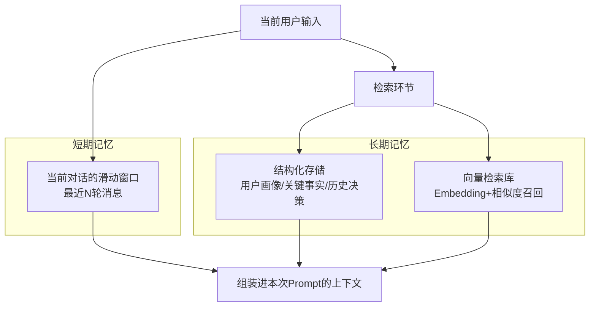
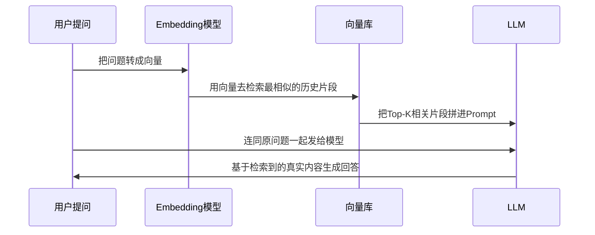
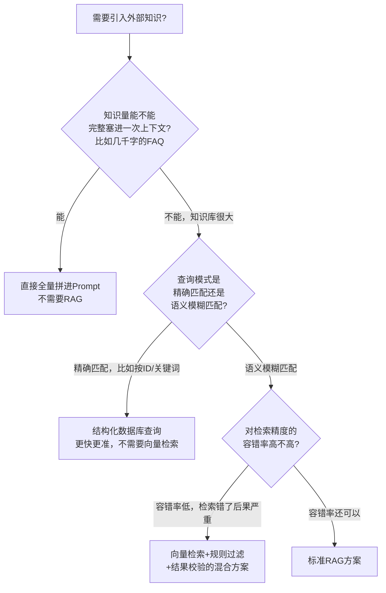

# 09 记忆与检索：Agent 怎么"记住"重要的事

## 先回到第03章的那个限制

Part 1 第03 章讲过大模型的三大局限之一：**上下文窗口有限，对话/任务变长后，前面的信息会被挤出去或被稀释。** 这一章要解决的问题就是：**当任务需要的信息量超过一次能塞进上下文的容量时，Agent 该怎么办？**

答案不是"等模型的上下文窗口变得无限大就好了"——即便窗口足够大，把所有历史一股脑塞进去也会导致"重要信息被无关信息稀释、成本飙升、检索精度下降"。真正的答案是：**设计一套"记忆架构"，让 Agent 在需要的时候能精准取回相关信息，而不是背下一切。**

## 记忆的两个层次

- **短期记忆**：最简单的实现就是第08 章迷你框架里的 `Memory` 类——一个消息列表，超出窗口就截断最老的部分。这解决"当前这一段对话"的连贯性。
- **长期记忆**：解决的是"跨会话、跨很长时间还要记得住"的问题。这里又分两种典型实现：
  - **结构化存储**：把关键事实提炼成结构化字段（比如"用户偏好""关键决策记录"），存进数据库，按ID 精确查询。
  - **向量检索（RAG 的核心组件）**：把文本转成向量（Embedding），存进向量库，需要时按"语义相似度"召回最相关的片段。

## RAG 到底在解决什么问题

RAG（Retrieval-Augmented Generation，检索增强生成）不是什么新范式，本质就是**"检索长期记忆 + 拼进 Prompt"**这个动作的工程化名字。完整流程：

**RAG 解决的核心问题：让模型的回答有真实依据，而不是靠参数记忆硬编。** 这直接对应第03 章讲的幻觉风险——如果一个事实性问题的答案能被检索到，就不该让模型凭"记忆"编。

## 决策框架：什么时候真的需要 RAG

这是产品经理最容易踩坑的地方——**看到"知识库问答"就默认要上向量检索，但很多场景根本不需要。**

**一个我踩过的真实坑**：在做知识库类问答时，一开始想当然地把所有内容都扔进向量库做语义检索，结果发现有一类查询（比如"查XX编号对应的具体记录"）用向量检索反而不如直接按 ID 精确查询准——**语义检索适合"我不确定用什么词但想找相关内容"的场景，不适合"我明确知道要找什么，只是需要精确定位"的场景。** 两种查询模式该用两种不同的检索方式，而不是无差别都上RAG。

## RAG 的常见陷阱

| 陷阱 | 表现 | 解决方向 |
|---|---|---|
| **切块（Chunking）策略不当** | 一段完整的逻辑被切成两半，检索到其中一半，上下文不完整 | 按语义边界切块（比如按段落/小节），而不是死板按字数切；关键内容加重叠区域 |
| **检索到了但模型没用上** | Top-K结果里明明有答案，但模型的回答还是不准确/忽略了检索内容 | 在Prompt里明确要求"必须基于以下检索内容回答，不要使用检索内容之外的知识"；把最相关的片段放在离问题最近的位置（减轻"lost in the middle"问题，第10章会展开） |
| **召回率与精确率的取舍** | Top-K 设置太小漏掉答案，太大又引入噪音稀释注意力 | 分阶段检索：先粗召回大量候选，再用一个更精确的排序模型（Rerank）二次筛选出最相关的少数几条 |
| **知识库过期没更新** | 检索到的是旧信息，模型基于旧信息给出过时回答 | 建立知识库更新机制，给每条记忆打时间戳，检索时优先/校验时效性 |

## 一个真实案例：跨源关联比"选一个数据源"更重要

我做过一个知识库项目，数据来源横跨会议记录、群聊、外部舆情、业务系统数据，一开始想"以哪个数据源为准"，后来发现这是个错误的框架——**真正有效的做法是"实体中心化对齐"：不选主数据源，而是给每条数据抽取出统一的实体标识（人物/事件/决策/报表ID等），再通过"强ID匹配→时间窗+关键词召回→语义判定→人工兜底"这条链路，把不同来源里说的"同一件事"关联起来。** 这比单纯"往一个向量库里塞所有数据再语义检索"复杂得多，但也正因为这套跨源关联能力，才能回答"外部反馈→内部讨论→决策→最终效果"这种因果链问题——这是企业知识库相对于一个简单问答机器人的真正壁垒。

## 产品经理清单

> - [ ] 我的知识库场景，是精确匹配还是语义模糊匹配？两者该用完全不同的检索技术，别一律上向量检索。
> - [ ] 我的切块策略，是按语义边界切的，还是简单粗暴按字数切的？后者容易切碎完整逻辑。
> - [ ] 我有没有验证过"检索到了正确内容"和"模型真的用上了这个内容"是两件事？
> - [ ] 如果我的场景涉及多个数据来源，我是在"选一个主数据源"，还是在做"跨源实体对齐"？后者的工程复杂度高得多，但也是真正的壁垒所在。

下一章，我们看看"塞进上下文里的东西该怎么组织"这个更精细的问题——上下文工程,不只是把检索结果拼进 Prompt 那么简单。

## 章节自测（5道单选，答案见文末）

**Q1.** RAG 本质是在做什么？
A. 训练新模型　B. 检索长期记忆+拼进Prompt的工程化实现　C. 压缩模型参数　D. 微调向量库

**Q2.** 什么场景不适合用向量检索，更适合结构化数据库精确查询？
A. 语义模糊匹配场景　B. 明确知道要找什么、只需要精确定位（比如按ID查询）的场景　C. 知识库很小的场景　D. 所有场景都适合向量检索

**Q3.** RAG常见陷阱中，"检索到了但模型没用上"的解决方向是什么？
A. 增大向量库规模　B. 在Prompt里明确要求必须基于检索内容回答，并把最相关片段放在离问题最近的位置　C. 换个embedding模型　D. 无法解决

**Q4.** 文中"跨源关联"案例的核心方法论是什么？
A. 选一个主数据源　B. 不选主数据源，做实体中心化对齐，通过多层链路关联不同来源数据　C. 全部丢进一个向量库　D. 忽略时效性

**Q5.** 判断是否需要RAG的第一个问题是什么？
A. 预算够不够　B. 知识量能不能完整塞进一次上下文　C. 团队会不会用向量数据库　D. 老板是否要求

点击查看参考答案

1-B　2-B　3-B　4-B　5-B

