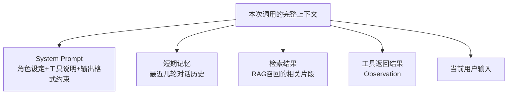
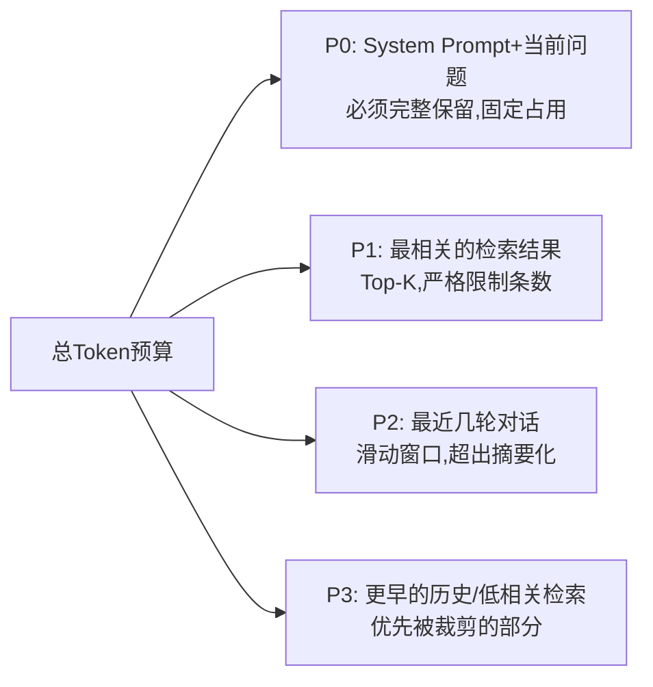

# 10 上下文工程：不止是 Prompt Engineering

## 一个概念上的升级

Part 1 第03 章讲过 Prompt 工程的三个层次（指令→示例→结构化约束），那一章聚焦的是"单次调用该怎么写好一段Prompt"。但当 Agent 要跑多轮、要接入检索结果、要维护记忆、要处理工具返回结果时，问题就升级成了：**"这一次调用模型时，上下文窗口里到底该放什么、放多少、放在哪个位置"——这就是上下文工程（Context Engineering）**，是比 Prompt 工程更大的一个概念。

## 上下文窗口里，到底装了什么

一次真实的Agent 调用，上下文里通常同时包含好几类内容：

**上下文工程要解决的核心问题：这五类内容加起来往往超过窗口容量或者互相稀释注意力，怎么取舍、怎么排布？**

## 核心问题一：Lost in the Middle（中间遗忘效应）

已有研究和大量实践都验证了一个现象：**模型对上下文开头和结尾的内容注意力更高，对中间部分的内容容易"看漏"。** 这意味着：如果你把检索到的最关键片段放在一堆无关信息的中间，即便它确实在上下文窗口里，模型也可能"注意不到"。

**实践启示**：
- 最重要的信息（比如当前用户的具体问题、最相关的检索结果）应该放在**靠近上下文末尾**（离生成位置最近）
- System Prompt 的关键约束放在**开头**，起到"锚定"作用
- 大量参考资料/长历史记录如果必须放，尽量放中间，但要在结尾处**重复强调关键要点**（用简短摘要的方式）

## 核心问题二：上下文压缩——不是所有历史都值得原样保留

一个朴素的做法是"把所有对话历史原样堆进上下文"，但这样做的问题是：**越到后面，历史记录占用的空间越大，真正有用的"当前任务相关信息"占比越低。**

### 三种压缩策略

| 策略 | 做法 | 适用场景 |
|---|---|---|
| **滑动窗口截断** | 只保留最近N 轮，超出直接丢弃 | 历史轮次的重要性随时间快速衰减的场景（比如闲聊） |
| **摘要压缩** | 定期让模型把较早的历史总结成一段摘要，替换掉原始多轮对话 | 长任务/长对话，早期细节不重要但"大方向"需要记住 |
| **关键信息提取** | 用LLM/规则从历史里抽取结构化的关键事实（比如"用户已确认预算是5万"），只保留这些结构化事实，丢弃对话过程 | 任务型对话，过程不重要，关键决策/事实才重要 |

**一个混合实践**：短期内的对话保留原文（滑动窗口），超出窗口的部分转成摘要，摘要里如果有极其关键的事实（比如用户明确的约束条件）单独提取成结构化字段常驻上下文——这是我在实际项目里验证过效果不错的分层方案。

## 核心问题三：给上下文"分优先级"，而不是等饱和了才处理

一个更成熟的上下文工程实践，是提前给不同类型的信息定好优先级和预算（Token 配额），而不是"能塞多少塞多少，塞满了再想办法砍"：

这种"预算制"思维的好处是：**当上下文压力增大时，你知道该优先牺牲哪部分，而不是被动地让某个环节意外爆窗口。**

## 一个容易被忽视的风险：上下文污染

多轮工具调用之后，Observation（工具返回结果）会不断累积进上下文。如果某一次工具调用返回了错误或无关信息，且没有被清理，**它会一直留在上下文里持续干扰后续的每一次决策**——这在长周期的自主规划循环（第04 章讲的 L2 级Agent）里非常常见，也是这类Agent 出现"越跑越离题"现象的常见原因之一。

**实践建议**：设计明确的"上下文清理"时机——比如每完成一个子任务后，把跟这个子任务相关但已经不再需要的中间过程从上下文里移除，只保留最终结论。

## 产品经理清单

> - [ ] 我的Agent 有没有针对"最重要的信息"和"次要信息"做位置排布？还是简单粗暴地按时间顺序堆叠？
> - [ ] 随着对话/任务变长，我的上下文占用是不是在无限增长？有没有设计压缩或摘要机制？
> - [ ] 我有没有观察到"Agent 跑到后期开始离题/重复/混乱"的现象？这很可能是上下文污染，需要设计清理机制。
> - [ ] 我是否给不同类型的上下文内容设定了明确的Token 预算优先级，而不是等窗口满了才手忙脚乱地砍？

下一章，我们从"Agent 自己内部的上下文管理"切换到"Agent 之间/Agent 和外部系统之间该怎么通信"——通信协议速查（MCP/A2A/ANP）。

## 章节自测（5道单选，答案见文末）

**Q1.** "Lost in the Middle"现象指的是什么？
A. 模型上下文窗口太小　B. 模型对上下文开头和结尾注意力更高，中间部分容易被忽略　C. 模型会中途丢失连接　D. 检索结果会丢失

**Q2.** 应对 Lost in the Middle 的实践启示是什么？
A. 把所有信息放在中间　B. 最重要信息放在靠近末尾（离生成位置最近），System Prompt关键约束放开头　C. 信息位置无关紧要　D. 只放在开头

**Q3.** 三种上下文压缩策略中，"关键信息提取"适合什么场景？
A. 闲聊场景　B. 任务型对话中过程不重要、关键决策/事实才重要的场景　C. 完全不需要压缩的场景　D. 只有短对话的场景

**Q4.** "上下文污染"指的是什么现象？
A. 上下文包含敏感词　B. 错误或无关的工具返回结果没被清理，持续留在上下文里干扰后续决策　C. 上下文格式错误　D. Token超支

**Q5.** "预算制"上下文管理思维的好处是什么？
A. 不需要考虑优先级　B. 上下文压力增大时明确知道该优先牺牲哪部分，而不是被动应对爆窗口　C. 可以无限扩展上下文　D. 与压缩策略无关

点击查看参考答案

1-B　2-B　3-B　4-B　5-B

