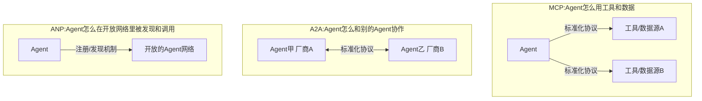

# 11 智能体通信协议速查：MCP / A2A / ANP

## 为什么产品经理也要懂协议

"协议"听起来是纯工程话题，但这里藏着一个产品级的判断：**你的Agent 要不要接入外部生态、要不要被别的系统调用、要不要和其他厂商的Agent 协作——这些问题的答案，直接决定了你该不该采用某个标准协议，而不是自己发明一套接口。** 选错了，轻则重复造轮子，重则你的Agent 变成一个"孤岛"，接不进任何生态。

## 三个协议分别解决什么问题

### MCP（Model Context Protocol）—— 解决"Agent 接工具"的标准化

**核心问题**：在MCP 出现之前，每接入一个新工具/数据源，都要写一套专属的对接代码——10个工具就是10 套接口逻辑，维护成本随工具数量线性增长。

**MCP 的解法**：定义一套统一的协议规范，工具/数据源只要实现一次"MCP Server"，任何支持 MCP 的Agent 客户端都能直接调用，不需要为每个Agent 单独适配。**这是"一次实现，多处复用"的标准化思路**——本质类似于USB 接口统一了外设和电脑的连接方式。

**什么时候该用**：只要你的Agent 需要连接多个外部工具/数据源，且未来这些工具可能被多个不同的Agent 客户端复用，用 MCP 几乎是没有争议的选择——这正是我自己在做数据分析Agent 项目时的真实架构选择（业务逻辑写一份，MCP 和 REST HTTP 两个接入口共享）。

### A2A（Agent2Agent）—— 解决"不同厂商的Agent怎么协作"

**核心问题**：如果你的Agent 需要和另一个团队/厂商开发的Agent 协作完成任务（比如你的旅行规划Agent 需要调用另一家公司的酒店预订Agent），双方的内部实现完全不同，怎么让它们能"对话"？

**A2A 的解法**：定义Agent 之间通信的标准消息格式和交互流程（比如任务委托、状态同步、结果返回），让不同厂商、不同框架实现的 Agent 可以在不了解对方内部实现的情况下协作——**这是"契约优先"的思路，类似于微服务之间通过标准 API 而不是共享代码库来协作。**

**什么时候该用**：你的场景涉及跨组织/跨厂商的Agent 协作，且没法要求对方改造成和你完全一致的内部实现时。如果只是你自己团队内部的多Agent 协作（比如第04 章讲的 L3 多智能体协作），完全可以用自定义的内部消息格式，不需要上重量级的跨厂商协议。

### ANP（Agent Network Protocol）—— 解决"开放网络里Agent 怎么被发现"

**核心问题**：A2A 解决了"两个已知的Agent 怎么通信"，但如果你的Agent 想在一个开放的、去中心化的网络里被"未知的其他Agent"发现和调用，需要一套发现机制和身份认证机制。

**ANP 的解法**：提供类似"Agent 的域名系统+身份协议"的能力，让Agent 可以被注册、被检索、被验证身份后调用。**这更偏向"Agent 互联网"的基础设施层，目前生态成熟度相对MCP 更早期。**

**什么时候该用**：绝大多数企业级场景现阶段还用不到——这是面向"未来 Agent 生态"的前瞻性协议，除非你在做面向开放生态的Agent 平台型产品，现阶段更适合了解而非立即采用。

## 选型速查表

| 协议 | 解决的问题 | 类比 | 成熟度（2026年视角） | 产品经理该问的问题 |
|---|---|---|---|---|
| MCP | Agent 怎么标准化接入工具/数据 | USB 接口 | 高，已被主流Agent 生态广泛采纳 | "我的工具/数据源会被多个 Agent 客户端复用吗？" |
| A2A | 不同厂商Agent 怎么协作 | 微服务间的API契约 | 中，头部厂商推动中 | "我需要和外部厂商的Agent 系统协作吗？" |
| ANP | Agent 在开放网络里怎么被发现 | 互联网DNS+身份认证 | 早期，生态仍在形成 | "我在做面向未来的开放Agent 生态平台吗？" |

## 一个务实的建议：不要为了"用上协议"而用协议

这三个协议解决的是不同规模、不同开放程度场景下的问题。**如果你的Agent只是内部系统、工具也只有自己在用，完全可以用最简单的内部 API 调用，不需要任何标准协议——协议的价值在于"多方复用/多方协作"，如果场景里根本没有"多方"，引入协议只是增加复杂度。** 这和Part 2 第07 章"很多时候你根本不需要框架"是同一个道理:先看清真实的复杂度来源，再决定要不要引入解决那类复杂度的标准化方案。

## 产品经理清单

> - [ ] 我的工具/数据源，未来会被不止一个Agent 客户端调用吗？如果会，MCP 值得优先考虑。
> - [ ] 我需要和外部厂商/团队的Agent 系统协作吗？如果只是内部多Agent协作，不需要上A2A 这种跨厂商协议。
> - [ ] 我是不是在"生态还没成熟、场景也没真正需要"的阶段，就想把协议当成技术亮点来用？

> 想真的动手搭一个 MCP 服务器，而不只是理解协议概念吗？番外篇配了一份保姆级实操：[《零基础保姆级：从零搭一个MCP服务器，并接入真实客户端》](https://harryjzhang69-web.github.io/harry-agent-course/book.html#/docs/bonus/番外03-MCP服务器从零搭建保姆级教程)，用真实的官方 `mcp` SDK 把 Part5 第19章的面试题库包成一个能被 Claude Desktop/Cursor 直接调用的标准服务，代码已实测跑通。

下一章，我们进入 Agent 能力的"训练"维度——Agentic RL 产品经理版，聊聊什么时候真的需要训练模型，而不是靠 Prompt 就能解决。

## 章节自测（5道单选，答案见文末）

**Q1.** MCP协议解决的核心问题是什么？
A. Agent之间怎么协作　B. Agent怎么标准化接入工具/数据源，避免每接一个工具都写专属对接代码　C. Agent怎么被发现　D. Agent怎么训练

**Q2.** A2A协议适合什么场景？
A. 内部团队自己的多Agent协作　B. 跨组织/跨厂商的Agent协作，且无法要求对方改造成一致实现　C. 单Agent场景　D. 完全不需要通信的场景

**Q3.** 文中对ANP协议的成熟度评价是什么？
A. 已经非常成熟　B. 早期阶段，生态仍在形成，多数企业级场景现阶段用不到　C. 比MCP更成熟　D. 已被淘汰

**Q4.** 内部团队自己的多Agent协作（L3级），文中建议怎么处理通信？
A. 必须用A2A标准协议　B. 完全可以用自定义的内部消息格式，不需要上重量级跨厂商协议　C. 必须用ANP　D. 不能有任何通信

**Q5.** 文中给出的核心原则是什么？
A. 能用协议就一定要用　B. 协议价值在于多方复用/协作，没有"多方"时引入协议只是增加复杂度　C. 协议越多越安全　D. 必须同时使用三种协议

点击查看参考答案

1-B　2-B　3-B　4-B　5-B

