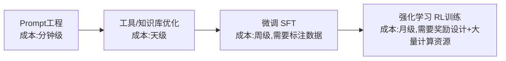
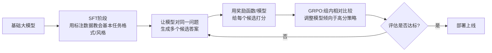
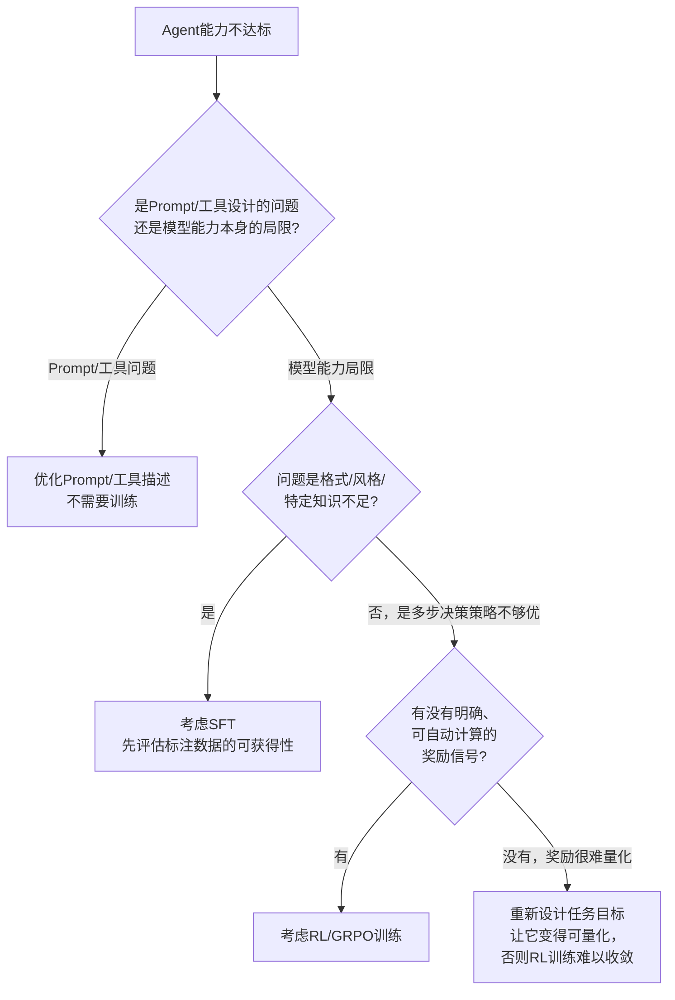

# 12 Agentic RL 产品经理版：SFT → GRPO，什么时候真的需要训练

## 先回答最该问的问题：我到底需不需要训练模型

这一章最容易被误读成"教你怎么训练模型"，但产品经理最该建立的认知反而是相反方向的：**绝大多数Agent 产品需求，靠Prompt 工程+工具设计就能解决，根本不需要走到训练这一步。** 训练是成本最高、周期最长、风险最大的能力提升手段，应该是"用尽了更便宜的手段之后"的最后选择，不是起点。

## 提升Agent 能力的手段，按成本从低到高排列

**决策原则：永远先把左边更便宜的手段用到极限，再考虑右边。** 我见过不少团队一上来就想"要不要训练一个专属模型"，但实际上换一个更精确的Prompt、或者把工具的返回结果格式改清楚，问题就解决了大半。

## SFT vs RL：两种训练分别解决什么问题

### SFT（Supervised Fine-Tuning，监督微调）

**核心机制**：用一批"输入→期望输出"的标注数据，让模型直接学习模仿这些示例的风格/格式/领域知识。

**适合解决的问题**：
- 模型输出的**格式/风格**不符合你的业务要求（比如需要特定的话术风格、特定的结构化输出格式），且用Prompt 里给示例（Few-shot）效果不稳定
- 需要模型掌握**领域专属知识**，且这些知识用检索增强（RAG）也覆盖不好（比如需要模型内化一套复杂的领域判断逻辑，而不只是查资料）

**产品经理该知道的成本关键**：SFT 的效果上限，很大程度取决于标注数据的质量和数量——"垂直领域几百条高质量标注数据"往往比"几千条粗糙数据"效果更好，数据质量是决定ROI 的关键变量。

### RL（强化学习，从RLHF 到 GRPO）

**核心机制**：不是简单模仿示例，而是让模型自己生成多个候选答案，通过一个"奖励信号"（Reward）告诉模型哪个更好，模型据此调整自己的决策倾向。GRPO（Group Relative Policy Optimization）是近年 Agentic RL 里常用的一种具体算法，核心思路是：对同一个问题生成一组候选回答，组内相对比较打分，而不需要单独训练一个复杂的价值网络——这让训练流程更简化、更适合Agent 这种"多步决策"场景。

**适合解决的问题**：
- 任务有**明确的、可自动计算的奖励信号**（比如"任务是否成功完成"、"代码是否通过测试"），而不需要人工逐条标注"应该怎么做"
- SFT 已经让模型学会了"基本套路"，但在**多步决策的最优策略选择**上还不够好（比如"什么时候该调用工具、什么时候该停止规划"这类决策，比单纯格式模仿更依赖"试错优化"）

**产品经理该知道的成本关键**：RL 训练的最大瓶颈往往不是算力，是**"怎么设计一个准确反映业务目标的奖励函数"**——奖励设计得不好，模型会学会"钻奖励函数的漏洞"而不是真正解决问题（这是强化学习领域著名的Reward Hacking 问题）。

## SFT→GRPO 训练闭环（产品经理理解版）

这条闭环里，**每一步都对应一次实际的资源投入决策**：SFT 阶段要不要标注更多数据、Reward 设计要不要更精细、GRPO 要跑几轮——产品经理不需要亲自写训练代码，但需要能判断"这一步的投入产出比划不划算"。

## 决策框架：我真的到了需要训练的阶段吗

## 产品经理清单

> - [ ] 我是不是跳过了"优化Prompt/工具设计"这个更便宜的手段，直接想着训练？
> - [ ] 如果考虑SFT，我有没有评估获取高质量标注数据的真实成本和周期？
> - [ ] 如果考虑RL，我能不能明确说出"奖励函数具体怎么计算"？说不清楚就说明还没准备好训练，先把任务目标量化清楚。
> - [ ] 训练这条路径的预期投入（时间/算力/人力）和预期收益，有没有认真算过账，还是"感觉应该会更好"？

下一章，我们讲怎么给Agent 的表现"打分"——评估体系与常见陷阱，这是所有前面章节最终都要接受检验的一环。

## 章节自测（5道单选，答案见文末）

**Q1.** 提升Agent能力的手段中，成本最低的是什么？
A. 强化学习训练　B. Prompt工程　C. SFT微调　D. 重新训练基础模型

**Q2.** SFT最适合解决什么问题？
A. 多步决策的最优策略选择　B. 模型输出格式/风格不符合业务要求，或需内化领域专属知识　C. 实时数据检索　D. 降低推理成本

**Q3.** RL训练最大的瓶颈往往是什么？
A. 算力不足　B. 怎么设计一个准确反映业务目标的奖励函数，否则容易出现Reward Hacking　C. 没有GPU　D. 数据太多

**Q4.** 文中反复强调的决策原则是什么？
A. 一开始就应该训练模型　B. 永远先把更便宜的手段用到极限，再考虑训练　C. 训练比Prompt工程更划算　D. SFT一定优于RL

**Q5.** GRPO算法的核心思路是什么？
A. 单独训练一个复杂价值网络　B. 对同一问题生成一组候选回答，组内相对比较打分调整模型倾向　C. 不需要奖励信号　D. 只能用于单步任务

点击查看参考答案

1-B　2-B　3-B　4-B　5-B

