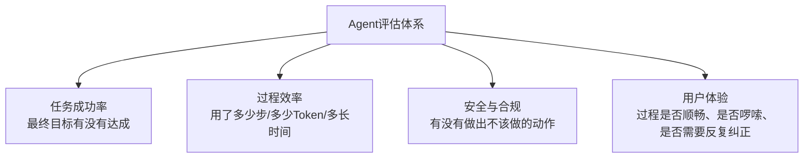
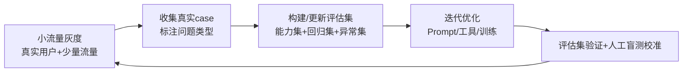

# 13 Agent 评估体系与常见陷阱

## 一句话概括这一章的核心矛盾

**"评估分数好看"和"用户觉得好用"，是两件经常脱节的事。** 这一章要讲的不是"怎么算出一个分数"，而是"怎么设计一套真正能反映产品好坏的评估体系，同时避开那些让你被分数骗了的陷阱"。

## Agent 评估该看哪些维度

单纯的"对话质量好不好"评估，对 Agent 是远远不够的——因为 Agent 的价值链条比一次问答长得多。一套完整的评估体系至少要覆盖四个维度：

| 维度 | 常见指标 | 容易被忽视的坑 |
|---|---|---|
| 任务成功率 | Pass@1、多次尝试成功率 | 只看"最终有没有做对"，忽略"是不是绕了很多不必要的弯路才做对" |
| 过程效率 | 平均步数、平均Token消耗、平均延迟 | 效率指标必须结合成功率一起看——步数少但经常失败没有意义 |
| 安全与合规 | 越权操作率、敏感内容触发率 | 安全测试集覆盖不全，容易被"边界之外"的输入绕过 |
| 用户体验 | 用户满意度、人工纠正率、放弃率 | 这是最难自动化评估、但往往最重要的维度——线下Benchmark 再好看，用户体验差照样留不住人 |

## 基准测试（Benchmark）方法论

###怎么构建一个靠谱的评估集

1. **覆盖真实分布，不是覆盖"容易测的场景"**：很多团队的评估集是"随手想几个例子"拼出来的，容易偏向简单/典型场景，覆盖不到真实用户会遇到的边界情况。更靠谱的做法是从真实用户日志/历史case里采样，保证分布贴近真实使用场景。
2. **区分"能力测试"和"回归测试"**：能力测试集用来评估"新版本是否比旧版本更强"，回归测试集专门收集历史上出过问题的case，确保"修好的问题不会再犯"。这两套集合的构建目的不同，不要混用同一套数据。
3. **人工标注的黄金集，规模不需要很大但质量要高**：几百条经过认真人工标注、有明确对错标准的数据，比几千条粗糙自动生成的数据更有参考价值——这一点跟第12 章讲的SFT 标注数据质量原则是一致的。

## 常见陷阱：为什么评估结果好看，产品体验却差

### 陷阱一：评估指标和真实业务目标不一致

比如一个客服 Agent，评估集里用"是否给出了正确答案"来打分，但真实业务目标其实是"用户问题有没有真正被解决、有没有减少人工介入率"——如果评估指标和业务目标脱节，你优化出来的模型可能在评估集上分数很高，但对业务的实际帮助有限。

### 陷阱二：Benchmark 过拟合

如果团队长期盯着同一套评估集去调优（不管是调Prompt 还是训练模型），很容易出现"针对这套题变得很强，但换一批没见过的真实case表现明显下降"的情况——这跟机器学习里经典的过拟合问题是一回事。**解决方式：定期用全新的、没有被用来调优过的数据做"盲测"，交叉验证评估集本身的有效性。**

### 陷阱三：自动化评估的"裁判模型"本身有偏见

用一个LLM 去给另一个LLM 的输出打分（LLM-as-Judge）是目前很常见的自动化评估手段，效率很高，但裁判模型本身可能有系统性偏好（比如偏好更长的回答、偏好特定的表达风格），导致评分结果系统性偏离真实质量。**解决方式：抽样用人工评估去校准裁判模型的评分，定期检查两者的一致性。**

### 陷阱四：只测试"正常路径"，不测试"异常路径"

很多评估集只覆盖用户按预期方式提问的场景，不测试"用户输入模糊/矛盾/恶意/边界条件"时Agent 的表现。**而这类异常路径恰恰是生产环境里最容易出问题、也最影响用户信任的地方。** 评估集应该专门划出一部分覆盖异常/边界case。

## 一套务实的评估节奏建议

**评估不是一次性的"上线前测试"，是一个跟产品迭代同步的持续闭环**——每一轮真实用户反馈都应该反哺进评估集，让评估集本身随着产品的真实使用场景一起进化。

## 产品经理清单

> - [ ] 我的评估指标，跟真实业务目标是不是同一件事？还是评估指标好看了，业务指标未必跟着好看？
> - [ ] 我有没有定期用"从没见过的新数据"做盲测，还是一直在同一套评估集上反复调优？
> - [ ] 如果用了LLM-as-Judge 自动化评估，有没有定期人工校准，确认裁判模型没有系统性偏见？
> - [ ] 我的评估集里，异常/边界case的占比是多少？是不是只覆盖了"正常提问"的场景？

Part 3 的核心能力篇到这里就结束了。我们从"怎么让Agent 记住重要的事"到"怎么管理有限的上下文"到"怎么和外部系统/其他Agent 通信"到"什么时候真的需要训练"再到"怎么评估效果"，补上了让 Agent 从"能跑Demo"到"能在生产里长期可靠运行"所需的全部关键能力。但还有一件事没讲——**Agent 能力越强，一旦被攻击或失控造成的损失也越大**，下一章我们讲Agent 安全与风险治理，把护栏也一起补上。

## 章节自测（5道单选，答案见文末）

**Q1.** 一套完整的Agent评估体系至少要覆盖哪四个维度？
A. 成本、速度、准确率、美观度　B. 任务成功率、过程效率、安全与合规、用户体验　C. 代码质量、文档完整度、Star数、下载量　D. 只需要任务成功率一个维度

**Q2.** "Benchmark过拟合"指的是什么现象？
A. 模型参数太多　B. 长期盯着同一套评估集调优，换一批没见过的真实case表现明显下降　C. 评估集太大　D. 训练数据不足

**Q3.** 用LLM-as-Judge做自动化评估的风险是什么？
A. 成本太高　B. 裁判模型本身可能有系统性偏好，导致评分系统性偏离真实质量　C. 速度太慢　D. 无法自动化

**Q4.** 构建评估集时，"能力测试集"和"回归测试集"的区别是什么？
A. 没有区别　B. 能力测试集评估新版本是否更强，回归测试集专门收集历史问题case确保不再犯　C. 回归测试集更大　D. 能力测试集不需要标注

**Q5.** 文中强调评估应该是什么性质的工作？
A. 一次性的上线前测试　B. 跟产品迭代同步的持续闭环，真实用户反馈应该反哺进评估集　C. 与产品迭代无关　D. 只需要做一次

点击查看参考答案

1-B　2-B　3-B　4-B　5-B

