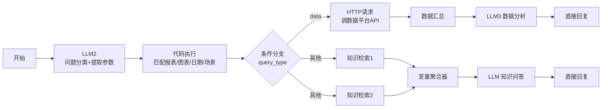
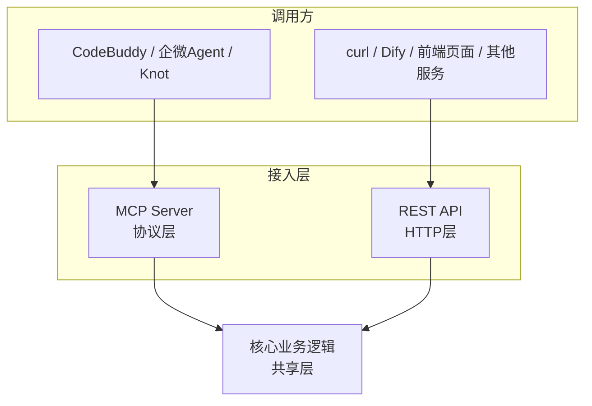

# 15 案例一：企业 IM 智能问答机器人——从 Dify 工作流到自建 MCP Server 架构

## 背景：一个真实的业务需求

我所在的团队每天要处理大量游戏数据报表查询——"这个游戏本周举报量多少""某个策略上线后效果怎么样"，这类问题原本要人工打开 BI 后台一个个查报表、拉数据、画图。我想做一个企业 IM 群机器人，@它就能自动查数据、给出分析。

这不是一个"要不要用 Agent"的问题——按 Part 1 第04 章的分级框架，这个需求路径明确不固定（用户可能问任意游戏、任意时间段、任意数据类型），至少需要 L1 单轮工具调用起步，实际业务复杂度决定了它需要走到"意图分类→参数提取→数据查询→分析生成"的多步流程。

## 第一阶段：Dify 工作流 MVP

按 Part 2 第06 章的建议，第一步永远是用低代码平台验证业务逻辑可行性。第一版结构：

半天时间跑通，验证了核心假设：**LLM 分类问题类型+提取结构化参数+调用真实数据接口，这条链路是可行的。** 这个阶段最大的收获不是代码，是确认了"这事能做"。

这一阶段踩的第一个坑是**Dify 变量插入**：变量必须用 `/` 键或 `{x}` 按钮插入才会显示为蓝色标签、真正生效；直接手打 `{{节点名.变量}}` 文本形式是无效的，看起来一样但不会被解析——这个坑很隐蔽，因为界面上文字长得一模一样，唯一区别是有没有变成蓝色标签。

## 第二阶段：切换到企业微信自带工作流

出于成本和生态整合的考虑，决定从 Dify 切换到企业微信自带的工作流（Agent+工具模式）。新链路：

### 核心 Bug：企微 HTTP 请求节点 POST body，Flask get_json() 返回 None

这是整个项目里最耗时的一次排查。现象：企微工作流的 HTTP 请求节点明明发送了 POST body，但后端 Flask 服务里 `request.get_json()` 始终返回 `None`，导致后续所有处理逻辑拿不到参数。

**排查过程**：
1. 先怀疑是网络层丢失了 body——用抓包工具确认 body 确实到达了服务器，内容完整。
2. 排除网络问题后，检查 Content-Type——发现企微 HTTP 节点发出的 `Content-Type` 头，虽然看起来是 `application/json`，但实际携带了额外的参数（比如带了字符集声明或其他后缀），而 Flask 的 `get_json()` 默认是严格匹配 Content-Type 的，一旦不是精确的 `application/json` 字符串就直接返回 `None`，不会报错，只是静默失败。
3. 确认根因后，设计了**7 层兜底解析策略** `_parse_weekly_body()`：
   - 第1层：`request.get_json()` 标准解析
   - 第2层：`request.get_json(force=True)` 强制解析（忽略 Content-Type 检查）
   - 第3层：手动读取 `request.data` 原始字节，用 `json.loads` 解析
   - 第4层：尝试从 URL query string 里解析（防止企微把参数塞到 URL 而不是 body）
   - 第5层：`request.form` 表单方式解析（防止 Content-Type 被识别成表单）
   - 第6层：URL 参数解包兜底（部分参数以 URL 编码形式混入）
   - 第7层：最终兜底日志记录，明确报错而不是静默返回空数据，方便后续排查

**这次踩坑的核心教训**：**低代码平台生成的 HTTP 请求，不能假设它严格遵循标准协议格式**——平台为了兼容性可能在 Content-Type、编码方式上做了"看起来标准但实际有细微差异"的处理，后端接口必须做多层兜底解析，而不能只写"标准情况下应该怎样"的代码。

## 第三阶段：从企微工作流到自建 MCP Server + REST API 架构

企微工作流跑通周报链路后，很快遇到新的边界：这条业务逻辑只能被企微入口调用，如果未来想让 CodeBuddy、Knot 智能体、或者一个网页前端也能用同样的查询能力，工作流本身没法直接复用——核心逻辑被锁死在企微平台内部。

这直接推动了架构重构：**业务逻辑写一份，MCP Server 和 REST API 只是两个不同的接入口。**

具体落地：
- MCP 工具：`allblue_data_query`（查询报表）、`allblue_weekly_report`（周报/月报）、`punish_flow_query`（处罚流水查询）
- REST 接口：`/api/allblue`（自然语言查询）、`/api/report/weekly`（周报/月报）、`/api/allblue/health`（健康检查）
- 两层接口内部调用完全相同的一套 Python 函数，不重复实现业务逻辑

**部署上的一个务实细节**：服务运行在轻量云环境上，用 `supervisorctl` 管理进程保证崩溃自动重启，配合一个 watchdog 脚本定期检查内网穿透隧道（loca.lt）是否还活着，因为隧道服务偶尔会断连需要自动重连——**这类"看起来不是 AI 技术、但决定服务能不能长期稳定跑"的运维细节，恰恰是从 Demo 到生产的分水岭。**

## 图片生成"非致命化"的设计原则

在周报生成链路里，除了文字分析还有一步是生成配图（数据可视化图表）。早期版本里，如果图片生成失败，整个请求会返回失败，用户什么都拿不到。后来改成**"图片生成失败不影响文字返回"**——文字分析和图片生成解耦成两个独立步骤，图片失败只是少了一张配图，核心的文字分析结果照常返回。

这是一个值得记住的通用设计原则：**在一个多步骤流程里，识别哪些步骤是"核心交付物"、哪些是"增值但非必需"，让非核心步骤的失败不阻断核心交付。** 这跟 Part 3 第13 章讲的"评估维度"是一致的——用户体验维度里，"总能拿到一个基本可用的结果"比"要么完美要么什么都没有"更重要。

## 验证结果

最终架构在多个真实游戏项目（不同数据体量、不同报表数量）上验证通过，从最初半天跑通的 Dify Demo，到最终能被多个不同入口稳定复用的自建服务，整个演进过程大约经历了：MVP 验证（1-2 天）→企微工作流迁移+核心 Bug 排查（3-5 天，其中 Bug 排查占了最长时间）→ MCP Server 架构重构（1 周左右）。

## 复盘：这个案例教会我的三件事

1. **低代码平台的 Bug 往往藏在"协议细节"里，不是逻辑设计的问题。** 排查这类问题的思路应该是"先确认数据有没有到、再确认格式对不对"，一步步隔离变量，而不是一开始就怀疑复杂的逻辑设计。
2. **"业务逻辑会不会被多入口复用"这个问题，越早想清楚越好。** 我们是先跑通单入口再重构成多入口共享架构，如果一开始就预判到这个需求，可以省掉一次架构迁移的成本。
3. **容错设计要分清"核心链路"和"增值链路"。** 不是所有失败都应该导致整体失败，识别出可以独立失败而不影响主体交付的部分，是提升系统鲁棒性最高性价比的手段。

## 产品经理清单

> - [ ] 我的低代码平台 MVP，验证的是"业务逻辑可行性"还是"最终架构"？两者不该混为一谈。
> - [ ] 遇到"看起来诡异"的集成 Bug 时，我是先怀疑复杂逻辑，还是先隔离"数据有没有到"和"格式对不对"这两个最基础的变量？
> - [ ] 我的系统里，哪些环节是"核心交付物"、哪些是"增值但可以失败"？后者有没有做到失败不拖垮整体？

下一章，我们接着看这个项目在"查数据"这一步本身遇到的更深层问题——数据分析 Agent 是怎么从"能查"演进到"查得准"的。

## 章节自测（5道单选，答案见文末）

**Q1.** 企微HTTP请求节点POST body后，Flask get_json()返回None的根因是什么？
A. 网络丢包　B. 企微发出的Content-Type看似标准但携带额外参数，Flask严格匹配导致静默返回None　C. 服务器宕机　D. body为空

**Q2.** 排查这个问题的最终解法是什么？
A. 换用另一个IM平台　B. 设计7层兜底解析策略，从标准get_json到强制解析到原始字节解析多层兜底　C. 忽略这个问题　D. 只用GET请求

**Q3.** 文中"业务逻辑写一份，MCP和REST API只是两个接入口"体现的架构原则是什么？
A. 每个入口单独实现一套逻辑　B. 核心业务逻辑独立于具体接入协议，多入口共享同一套实现　C. 只能有一个入口　D. MCP和REST不能共存

**Q4.** 图片生成"非致命化"设计体现的原则是什么？
A. 图片比文字更重要　B. 区分核心交付物和增值但非必需的部分，让非核心步骤失败不阻断核心交付　C. 所有步骤都同等重要不能失败　D. 失败就应该整体报错

**Q5.** 文中排查诡异Bug的核心方法论是什么？
A. 直接猜测复杂逻辑问题　B. 先确认数据有没有到、再确认格式对不对，一步步隔离变量　C. 重写全部代码　D. 换个框架

点击查看参考答案

1-B　2-B　3-B　4-B　5-B

