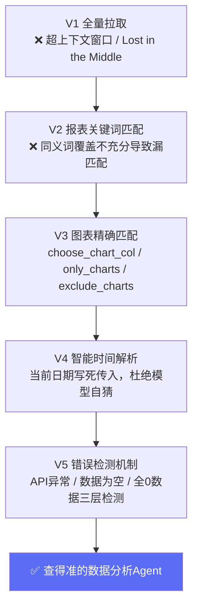

# 16 案例二：数据分析 Agent 架构演进——从"能查"到"查得准"的层层加固

## 背景：一个比想象中复杂得多的"查数据"需求

延续案例一的项目，当数据查询能力接入真实的游戏数据报表平台后，我很快发现："让 LLM 查数据"这件事，比它听起来简单的表面复杂得多。同一个游戏在数据平台上有几十上百个报表，每个报表下又有几十个图表，用户的自然语言提问和这些报表/图表之间，需要一层精确的"翻译"。

## 第一版：全量拉取，让 LLM 自己从海量数据里找答案

最朴素的做法：用户问"这个游戏的举报情况"，直接把这个游戏下所有报表全部数据拉出来，扔给 LLM 去总结。**这是一个典型的"没有做检索、直接堆上下文"的反面案例**——对应 Part 3 第09 章讲的"知识量能不能塞进一次上下文"的判断。

问题很快暴露：数据量太大，一个游戏几十个报表的全量数据远超单次上下文窗口；即便硬塞进去，Part 3 第10 章讲的"Lost in the Middle"效应导致 LLM 经常抓不住真正相关的那几个数字，混在大量无关图表数据里，回答开始变得笼统、甚至张冠李戴。

## 第二版：报表关键词匹配

引入 `GAME_CONFIG` 配置结构，给每个游戏的每个报表配置 `keywords`（触发匹配的关键词列表），用户提问先匹配关键词，命中哪个报表就只拉那个报表的数据。这一步显著收窄了数据范围。

### 踩坑：关键词覆盖不充分导致精确匹配失效

真实运行中发现：**同一个功能，不同人会用完全不同的词来问。** 比如"推单"这个功能，有的用户问"推单情况"，有的问"推送量级"，有的问"机审推送了多少"，有的直接说"机器审核"。如果 `keywords` 只配了"推单"，其他三种问法都匹配不到，会退化成走场景级的全量匹配，进而导致案例一提过的"上下文过载"问题重新出现。

**修复原则**：★ 关键词配置要充分，同一功能的所有常见同义词都要覆盖（"推单/推送/机器审核/机审推送"配成一组）。这个原则后来被写成了标准操作流程的第一条：任何新增报表配置，第一步就是要求业务方或者从历史提问日志里，把这个报表相关的所有可能问法都列出来，一次性配全，而不是等用户反馈"查不到"才补一个词。

## 第三版：图表级精确匹配（choose_chart_col）

报表级匹配解决了"拉哪个报表"，但一个报表下往往有几十张图表，同样存在信息过载问题。进一步引入图表级的语义匹配：`choose_chart_col` 参数支持指定具体拉取哪几个图表，通过预先给每个图表配置 `charts_desc`（图表名到业务含义的映射），让匹配逻辑能理解"用户问的是哪张图"。

具体机制：
- `only_charts`：白名单模式，只展示指定的这些图表（适合一个报表里大部分图表跟当前业务场景无关的情况）
- `exclude_charts`：黑名单模式，排除指定图表，其余全部展示（适合大部分图表都有用、只有少数几个要排除的情况）
- 每个保留的图表都要在 `charts_desc` 里写清楚业务含义，这一步看起来是纯文档工作，但直接决定了 LLM 后续做数据分析时能不能正确理解这张图表里的数字代表什么业务含义

一个真实案例：某个游戏的一个报表下有 40+ 图表，通过精确配置只保留业务相关的几个核心图表（举报人工审核判白、图片恶意类型分布、内容检测情况等），过滤掉几十个无关图表，回答准确率明显提升，因为 LLM 不再需要在几十个数字里"找线索"。

## 第四版：智能时间解析

用户提问经常包含自然语言时间表达："上个月""去年11月""近30天""12月上旬"。这里踩了一个反直觉的坑：

**坑：不能依赖模型自己判断"今天是哪天"。** LLM 的训练数据有截止日期，模型对"当前日期"的感知并不可靠（系统日期变量在某些运行环境下也不一定准确）。解法是：**在 Prompt 里把当前日期明确写死传入**，让模型只做"相对时间表达→具体日期"的计算，而不是让模型自己猜测当前是哪一天。

同时还要配置一批"上旬/中旬/下旬""去年/前年"这类中文时间表达的具体计算规则，让 LLM 输出结构化的 `from_date`/`to_date` 具体日期，而不是继续用模糊的自然语言表达传给下游查询接口。

### 另一个细节优化：单日 vs 趋势判断

后续发现：当用户问"每日/每天"或"多少人/局/个/条"这类问题时，实际需要的往往是某一天的具体数字，而不是默认给出的7天趋势数据。如果默认给7天数据，LLM 在生成回答时反而会被多余的趋势信息干扰，把简单问题复杂化。修复：识别到这类关键词后，自动解析为查询"昨天"这一个单日的数据，而不是默认的一段时间趋势。

## 第五版：错误检测机制

在数据汇总节点加入三类检测：
1. **API 异常检测**：接口返回非 200 状态码或者返回体里有错误字段，明确标记"数据源查询失败"，不要让 LLM 把失败误判成"这个指标就是缺失/是0"。
2. **数据为空检测**：接口正常返回但 data 字段为空数组，明确提示"该时间段无数据"，区别于"接口失败"和"确实是0"。
3. **全0数据检测**：所有数值字段都是0，这经常是一个隐藏的异常信号（比如查询的时间范围超出了数据保留期，或者报表 ID/游戏 ID 配置错了），需要单独警告而不是让 LLM 直接得出"这项指标本周为0"的结论。

**这一步的核心价值**：没有这层检测之前，出现过好几次"接口其实挂了，但 LLM 收到空数据后，很自信地生成了一段'本周XX指标为0，情况良好'的分析"——这是典型的**幻觉在数据分析场景里的表现形式**：不是编造事实，是对"缺失数据"和"真实为0"缺乏区分能力，把系统性故障误报成了业务结论。

## 数值精度的一个隐蔽坑

数值格式化函数最初直接用常规的四舍五入/科学计数法处理，发现类似 0.003 这种小数级别的指标，会被近似处理成 0，导致一些真实存在但数值很小的指标看起来像是"完全没有"。修复为支持小数精度识别，确保 0.00x 级别的真实数值不会被误显示为0——这是"数据展示层"的一个细节坑，容易被忽视，但直接影响分析结论的准确性。

## 五版演进全景图

## 复盘：这个案例教会我的三件事

1. **关键词/语义匹配系统的鲁棒性，取决于"同义词覆盖是否充分"，而不是匹配算法本身多聪明。** 这是一个需要持续运营和补充的配置资产，不是一次性能做完的技术工作。
2. **时间解析看起来是小事，但"依赖模型自己判断当前日期"是一个所有 Agent 项目都容易踩的通用坑**——任何涉及"相对时间"计算的场景，都应该把绝对的当前日期作为确定性输入传给模型，而不是让模型自己推断。
3. **区分"系统故障"和"业务真实为0"是数据类 Agent 最容易被忽视但影响最大的护栏。** 没有这层检测，Agent 会用非常自信的语气讲述一个基于错误数据的结论，这种"自信的错误"比"不知道"对用户信任的伤害更大。

## 产品经理清单

> - [ ] 我的关键词/规则配置，是"一次性穷举所有已知同义词"，还是"等用户反馈再一个个补"？后者会让用户体验长期不稳定。
> - [ ] 我的 Agent 涉及"相对时间"计算的地方，有没有把绝对当前日期作为确定性输入，而不是让模型自己推断？
> - [ ] 我的系统能不能区分"接口失败/数据为空/真实为0"这三种情况？如果不能，模型很可能会把系统故障讲成一个自信的错误结论。

下一章，我们看一个完全不同规模的案例——一个独立开发者从0到1一周做出一个 AI 小产品，会踩到哪些"教科书里不会写"的坑。

## 章节自测（5道单选，答案见文末）

**Q1.** 第一版"全量拉取"方案的问题是什么？
A. 成本太低　B. 数据量超上下文窗口，Lost in the Middle导致模型抓不住真正相关的数字　C. 速度太快　D. 没有问题

**Q2.** 关键词匹配踩的坑是什么？
A. 关键词太多　B. 同一功能不同用户问法不同，关键词覆盖不充分导致匹配失效　C. 关键词全部匹配　D. 不需要关键词

**Q3.** 时间解析中的关键坑是什么？
A. 不能依赖模型自己判断当前日期，必须在Prompt里把当前日期明确写死传入　B. 必须用UTC时间　C. 不需要处理相对时间　D. 只支持绝对日期

**Q4.** 错误检测机制里，"全0数据"检测的意义是什么？
A. 全0一定是数据错误需要报错　B. 全0经常是隐藏异常信号，需要单独警告而非让LLM直接下结论　C. 不需要处理　D. 全0应该直接删除

**Q5.** 文中提到的"幻觉在数据分析场景的表现形式"是什么？
A. 编造不存在的事实　B. 对缺失数据和真实为0缺乏区分能力，把系统性故障误报成业务结论　C. 输出格式错误　D. 响应速度慢

点击查看参考答案

1-B　2-B　3-A　4-B　5-B

