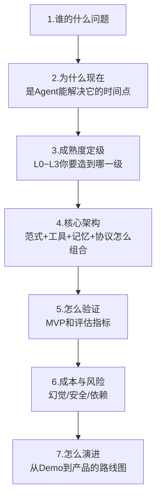
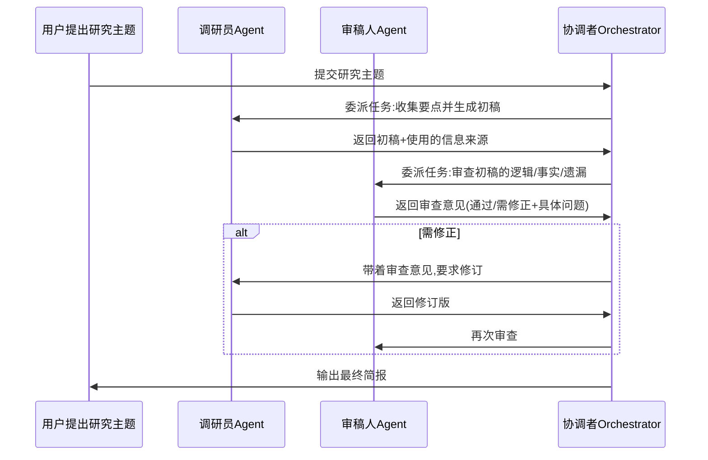

# 19 毕业设计：设计你自己的 Agent 产品 Pitch

## 为什么用"Pitch"而不是"技术方案"收尾

学完前面十几章的概念和方法论，最容易出现的问题是——**知识散落在脑子里，但没有变成一个能讲给别人听、能落地执行的东西。** 这一章不是让你再学新概念，是给你一个模板，逼自己把学到的所有判断框架，串成一份完整的产品Pitch。

一份好的 Agent 产品 Pitch，应该是"讲给投资人/老板/合伙人听也不心虚"的东西，而不是一份只有你自己看得懂的技术笔记。

## Pitch 模板：七个必答的问题



### 1. 谁的什么问题（不是"我能做什么"）

先讲清楚：具体是谁（哪类用户/哪个业务场景）、遇到了什么具体的痛点、这个痛点现在是怎么解决的（哪怕是"手动做"）、现在的解决方式差在哪。**不要一上来就讲"我要做一个XX Agent"，先讲人和问题。**

### 2. 为什么现在是Agent 能解决它的时间点

对应 Part 1 第02 章讲的进化史——用一句话说清楚："这个问题过去解决不好，是因为缺哪块拼图（常识/语言理解/工具调用能力），而现在的LLM 刚好补上了这块拼图。"这是判断"这个想法是不是蹭概念"的分水岭。

### 3. 成熟度定级：L0~L3 你要造到哪一级

对应 Part 1 第04 章的分级框架。明确回答：这个产品到底需要L1单轮工具调用就够，还是真的需要 L2 自主规划循环，甚至L3 多智能体协作？**说清楚"为什么不是更低的级别就够了"，也说清楚"为什么不需要更高的级别"。**

### 4. 核心架构：范式+工具+记忆+协议怎么组合

对应 Part 2、Part 3 的内容。用一张架构图说清楚：用了哪种范式（ReAct/Plan-and-Solve/Reflection 或组合）、接了哪些工具（是否用 MCP 标准化）、记忆怎么设计（要不要RAG）、上下文怎么管理。

### 5. 怎么验证：MVP 和评估指标

对应 Part 3 第13 章。说清楚：MVP 阶段用什么最小的方式验证核心假设、用什么评估指标衡量"做得好不好"、这些指标跟真实业务目标是不是一致的。

### 6. 成本与风险：幻觉/安全/依赖

诚实地列出这个产品的风险点：模型幻觉在这个场景里可能造成什么后果、有没有护栏机制、对第三方模型/服务的依赖程度有多高、如果依赖的模型服务变动（涨价/下线）该怎么应对。

### 7. 怎么演进：从Demo 到产品的路线图

参照 Part 4（真实项目复盘）里的经验——一个真实项目从最初的简单方案，到发现局限，到重构演进的完整过程。提前想清楚"当前方案在什么条件下会遇到瓶颈，下一步该往哪个方向演进"。

## 一份最小可用的 Pitch 大纲（可以直接照抄结构）

```markdown
# [产品名] · Agent 产品 Pitch

## 1. 问题
- 用户: ...
- 场景: ...
- 现状痛点: ...

## 2. 为什么现在能做
- 过去缺的拼图: ...
- LLM 补上了什么: ...

## 3. 成熟度定级
- 目标级别: L_
- 理由: ...

## 4. 架构设计
[架构图]
- 范式: ...
- 工具/协议: ...
- 记忆设计: ...

## 5. MVP 与验证指标
- MVP范围: ...
- 核心指标: ...

## 6. 风险与护栏
- 幻觉风险点: ...
- 安全护栏: ...
- 依赖风险: ...

## 7. 演进路线图
- 阶段一(MVP): ...
- 阶段二(规模化): ...
- 阶段三(...): ...
```

## 产品经理清单（这一章是终章清单，把前面所有的清单串起来检验一次）

> - [ ] 我能不能用一句话说清楚"谁的什么问题"，而不是先讲技术方案？
> - [ ] 我的成熟度定级选择，有没有真实的依据，而不是"觉得应该做到这个级别"？
> - [ ] 我的架构设计里，每一个组件（范式/工具/记忆/协议）的引入，都对应着一个真实存在的复杂度来源吗？
> - [ ] 我的验证指标，跟真实业务目标是同一件事吗？
> - [ ] 我有没有诚实地列出这个产品最大的风险，而不是只讲亮点？

## 毕业作品：亲手搭一个真实跑通的多智能体协作 Demo

前面七个问题帮你把想法整理成一份能讲的 Pitch，但**一份只停留在纸面的 Pitch，说服力终究有限**。这门课的毕业作品，是让你亲手跑通一个真实的多智能体协作系统——对应 Part1 第04 章讲的 L3 级能力，也是全书唯一一处"两个 Agent 真的互相通信协作完成任务"的可运行代码。

配套代码在 [`demos/06-multi-agent-collab`](../../demos/06-multi-agent-collab)，实现的是一个"调研员 Agent + 审稿人 Agent"协作产出一份研究简报的最小系统：



跑通这个 demo 之后，建议你对照本章的 Pitch 模板，把它包装成一份完整的毕业 Pitch：**它的"谁的什么问题"是什么？为什么这个任务需要两个角色分工而不是一个 Agent 自己完成（对应 Part1 第04章 L3 的判断条件）？协调者的委派逻辑怎么设计的？如果审稿人一直不通过怎么防止无限循环？这里面有没有需要 Part3 第15章讲的护栏（比如给协作轮数设上限、给最终输出加人工确认）？**

**毕业标准**：不要求你的项目多复杂，但要求你能对着这个真实跑起来的系统，用本课程学到的框架，逐条回答清楚"为什么这样设计"，而不是"跑起来就行"。这才是这门课真正想教给你的东西——**不是记住多少概念，是拿到一个真实系统时，有没有一套自己的判断语言。**

下一章是最后一章：把这套系统性认知，转化成能应对真实面试的知识储备——AI 产品经理/Agent 工程师转型面试题库。

## 章节自测（5道单选，答案见文末）

**Q1.** Pitch模板七个问题中，"为什么现在是Agent能解决它的时间点"对应哪一章的框架？
A. Part1第01章　B. Part1第02章 Agent进化史　C. Part3第14章　D. Part2第07章

**Q2.** "成熟度定级"这一步要求你同时说清楚什么？
A. 只需要说做到哪一级　B. 既要说清楚为什么不是更低级别就够，也要说清楚为什么不需要更高级别　C. 只需要成本　D. 只需要架构图

**Q3.** Pitch里"成本与风险"部分要求诚实列出什么？
A. 只列亮点　B. 模型幻觉风险、护栏机制、第三方依赖程度及应对方案　C. 只列成功案例　D. 不需要谈风险

**Q4.** 毕业设计的多智能体协作Capstone项目（demo06），核心是验证什么能力？
A. 单Agent的Prompt设计能力　B. 多个Agent真实互相通信协作完成任务的能力　C. 前端UI设计能力　D. 数据库设计能力

**Q5.** 文中强调一份好Pitch应该是什么样的？
A. 只有自己看得懂的技术笔记　B. 讲给投资人/老板/合伙人听也不心虚的东西　C. 尽量复杂显得有技术含量　D. 越长越好

<details>
<summary>点击查看参考答案</summary>

1-B　2-B　3-B　4-B　5-B

</details>
