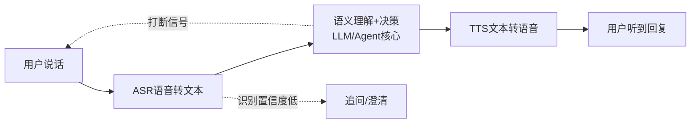
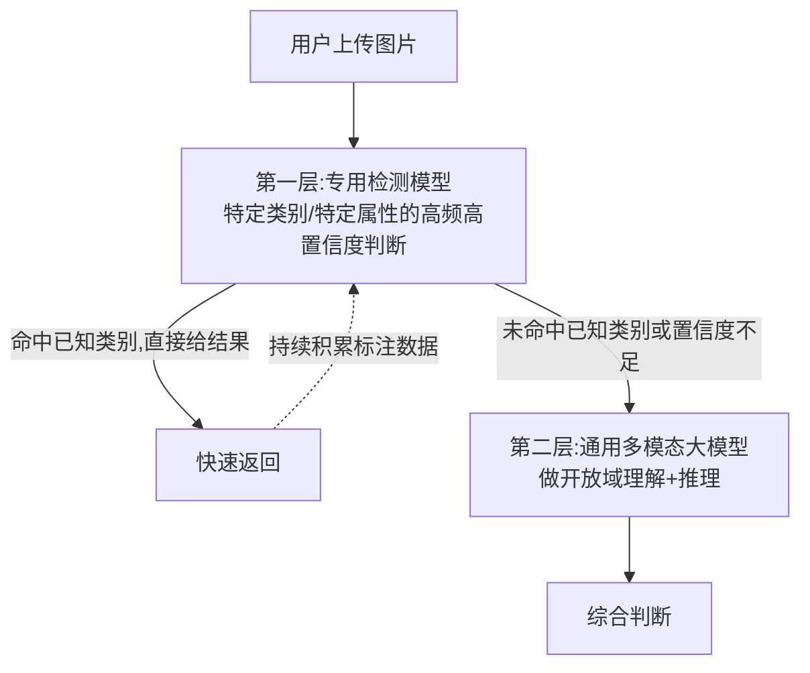
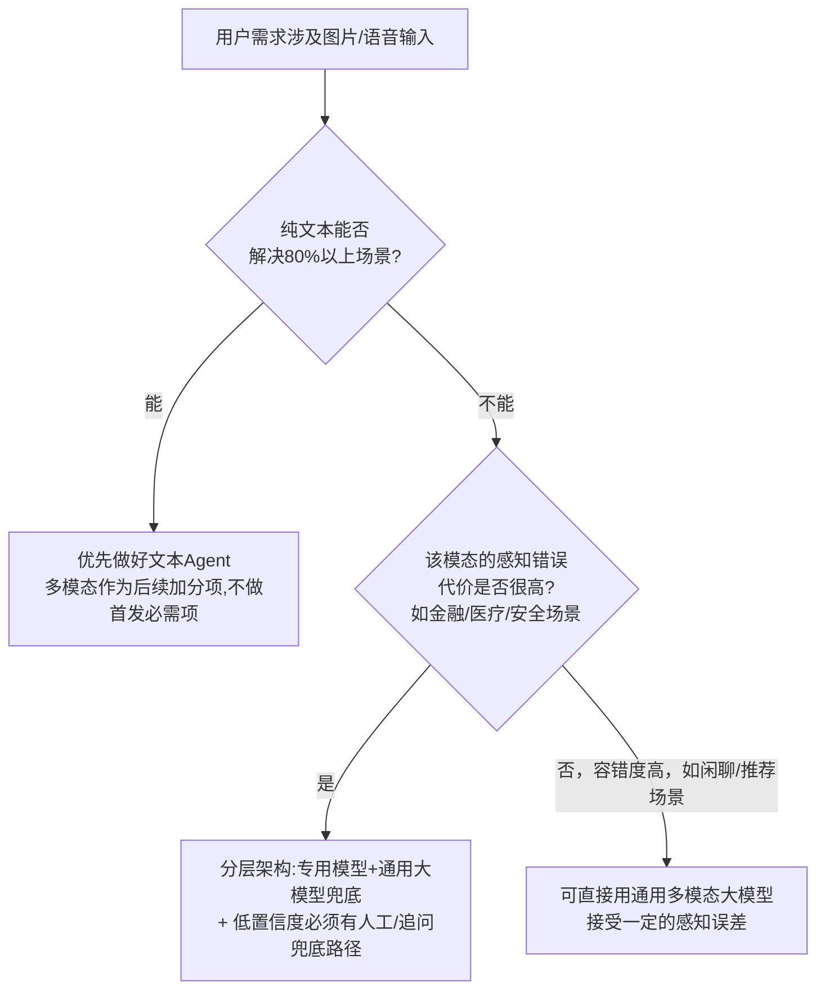

# 21 多模态 Agent 专题：语音 / 图片 / 视觉场景的产品设计

## 为什么多模态不是"加个输入框"这么简单

很多团队对"做一个多模态 Agent"的理解停留在——把文本输入框换成一个能传图片/语音的输入框，剩下的交给一个多模态大模型就行了。**这个理解会让你低估至少三件事：延迟预算、成本结构、以及"看错/听错"之后谁来兜底。** 文本输入是离散的、确定的、几乎零解析成本的；语音和图片输入天生带着一层"感知层的不确定性"——语音可能听岔、图片可能识别错主体，这层不确定性会一直向下游传导，如果产品设计时没考虑，等于在整条链路的第一步就埋了一个无法完全消除的错误源。

我在腾讯做游戏 UGC 内容安全时处理的正是这类"多模态感知+决策"系统，只是场景是审核而不是助理——语音要不要判定违规、图片要不要判定违规，本质上和"语音 Agent 该怎么理解用户指令""图片 Agent 该怎么理解用户上传的内容"是同一类工程问题：**输入不是纯文本，决策却必须做出来，而且做错的代价是真实的。**

## 语音 Agent：别把"能听懂"和"体验好"混为一谈

语音 Agent 的产品体验，**七成决定于这条闭环里三个容易被忽视的细节**，而不是核心大模型选得多强：

- **实时性 vs 准确性的权衡**：ASR 越快返回、误识别率往往越高；等更长时间做二次校验，用户会觉得"卡顿"。产品上必须明确一个场景优先级——客服类场景通常准确性优先（听错一个关键词可能导向完全错误的处理），闲聊陪伴类场景通常实时性优先（哪怕偶尔听岔，流畅感比精确度更重要）。
- **打断机制**：真人对话里"打断"是常态，但很多语音 Agent 的第一版是"说完才能打断"，用户体验会明显不自然。要支持打断，意味着 TTS 播放和 ASR 监听必须能同时进行，这是一个架构决策，不是后期能轻易补上的优化项。
- **低置信度时的追问设计**：ASR 会给出识别置信度，产品经理容易忽略这个信号——置信度低的时候，比起"猜一个答案往下走错到底"，主动追问一句"您是想问 XX 还是 YY"，代价远低于把错误答案带进后面几轮对话。

## 图片/视觉 Agent：分层架构比单一大模型更靠谱

一个常见误区是"上传图片交给多模态大模型直接理解就够了"。在真实生产场景里（无论是审核还是助理类应用），**更稳健的做法是分层架构：专用检测模型负责高频、高确定性的子任务，通用多模态大模型负责长尾、需要推理的子任务，两者互补而不是二选一。**

这套"专用模型打头阵、通用大模型兜底长尾"的分层思路，在我实际做过的图片内容风险检测里验证得很扎实：**新增一个具体的风险类别，先用少量标注数据训练一个轻量的专用检测标签模型上线，覆盖最高频的那批case；同时通用多模态大模型作为前置的兜底判断，处理专用模型没见过的新花样。** 这套架构的好处是——专用模型响应快、成本低、对已知模式的准确率很高；通用大模型慢一点、贵一点，但能处理"没被专门训练过的新情况"，两者组合覆盖率远高于任何单一方案。**做产品设计时，"要不要为这个多模态场景单独训一个轻量模型"，本质是一个成本/延迟/准确率的三角权衡，值不值得投入取决于这个场景的请求量级和确定性程度。**

## 决策框架：什么时候该做多模态，什么时候该"绕过去"

## 产品经理清单

> - [ ] 这个场景是"必须支持多模态"还是"支持了体验更好，但不支持也能用文本兜底"？我有没有先把文本闭环做扎实？
> - [ ] 我的语音/图片场景，识别错误之后有没有兜底路径（追问、置信度提示、人工复核），还是"错了就直接错到底"？
> - [ ] 对于高频且高确定性的子任务，我有没有评估过用一个轻量专用模型能不能比直接调通用大模型更快、更便宜、更准？
> - [ ] 语音场景里，我有没有明确定义这个场景是"实时性优先"还是"准确性优先"，并据此做技术选型？

## 小结

多模态 Agent 的核心难点不在"接入一个能看/能听的大模型"，而在于**给"感知层的不确定性"设计一整套产品级的兜底机制**——这跟做内容安全审核系统时"机审拿不准就转人工"的思路是同一个道理，只是这里的"人工"经常要换成"追问用户"或"降级到确定性更高的子路径"。做好这一层，才谈得上"体验好"，不然多模态只是让产品在更多地方能出错。

下一章，我们从"怎么把产品做好"，切换到"怎么验证这个产品到底好不好"——Agent 产品的 AB 测试方法论。

## 章节自测（5道单选，答案见文末）

**Q1.** 文中认为语音 Agent 产品体验的关键，主要取决于什么？
A. 核心大模型参数量　B. 实时性/准确性权衡、打断机制、低置信度追问设计等闭环细节　C. 服务器数量　D. 用户网速

**Q2.** 图片/视觉 Agent 的"分层架构"指的是什么？
A. 只用一个通用大模型　B. 专用检测模型负责高频高确定性子任务，通用多模态大模型负责长尾推理，两者互补　C. 只用专用模型不用大模型　D. 图片和文本分开两个产品

**Q3.** 文中判断"要不要为某个多模态场景单独训一个轻量模型"的核心依据是什么？
A. 团队人数　B. 这个场景的请求量级和确定性程度，本质是成本/延迟/准确率的三角权衡　C. 老板喜好　D. 模型越多越好

**Q4.** 决策框架中，什么情况下应该优先做好文本Agent而不急于上多模态？
A. 任何情况都要优先做多模态　B. 纯文本已能解决80%以上场景时，多模态作为加分项而非首发必需项　C. 从不需要考虑文本　D. 只要有预算就该上多模态

**Q5.** 文中提到的"低置信度追问"设计的价值是什么？
A. 增加对话轮次显得更智能　B. 比起带着错误识别结果继续往下走，主动追问的代价远低于把错误答案带进后续对话　C. 没有实际价值　D. 只是为了炫技

点击查看参考答案

1-B　2-B　3-B　4-B　5-B

