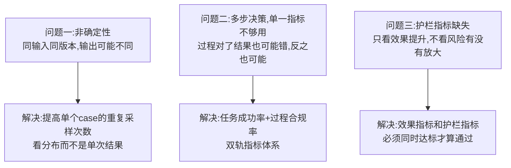
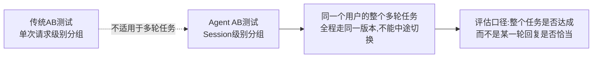
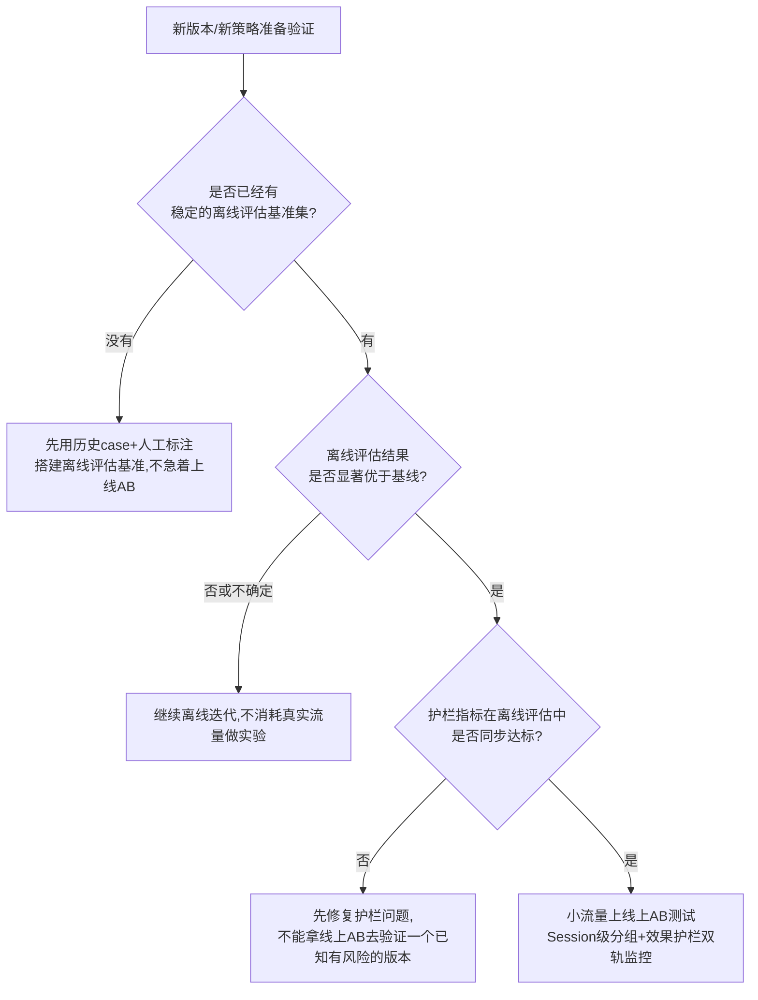

# 22 Agent 产品的 AB 测试方法论：给"会自主决策"的产品做实验

## 为什么传统 AB 测试方法论会在 Agent 产品上失灵

传统 AB 测试的成立前提是：**同一个输入，在同一个版本下，大概率会得到相近的输出**——这样你才能把"效果差异"干净地归因到"版本差异"上。Agent 产品打破了这个前提：**同一句用户输入，同一个版本，两次调用可能走出两条完全不同的执行路径**（工具调用顺序不同、中间推理步骤不同、甚至最终答案的措辞完全不同）。如果直接套用传统 AB 测试的统计方法，你会发现噪声大到快把真实的版本差异淹没——**这不是样本量不够的问题，是"响应本身自带随机性"这个新变量没被建模进去。**

## Agent AB 测试要解决的三个新问题

### 问题一：非确定性——看分布，不看单次

对同一批 case，Agent 新旧版本各跑多次（不是跑一次就下结论），观察**成功率的分布**而不是某一次的结果。如果新版本平均成功率更高但方差也大得多（意味着"有时候很好、有时候很差"），这种"不稳定的提升"在真实产品里往往比"稳定但提升小"更危险——用户对不稳定体验的容忍度远低于对普通体验的容忍度。

### 问题二：单一指标不够——任务成功率 + 过程合规率双轨

一个 Agent 任务"结果对了"，不代表"过程对了"——它可能因为运气好绕过了一个本该拦截的风险动作，恰好没造成损失。反过来，"过程完全合规"也不代表"结果一定好"。**AB 测试必须同时看两条线：**

| 指标 | 衡量什么 | 常见坑 |
|---|---|---|
| 任务成功率 | 最终结果是否达成用户目标 | 只看这个会漏掉"侥幸走对但过程有风险"的case |
| 过程合规率 | 执行路径是否遵守了预设的护栏（权限范围/高风险动作确认/工具调用是否必要） | 只看这个会忽略"过程规范但结果没用"的形式主义 |
| 用户满意度（人工/隐式反馈） | 用户是否认可这次交互 | 容易被"回答得很自信但不对"的case误导，需要配合任务成功率交叉验证 |
| 成本效率 | 完成同样任务消耗的Token/调用次数/耗时 | 容易被忽略——新版本效果提升5%但成本翻倍，商业上未必划算 |

### 问题三：护栏指标——效果提升不能拿风险去换

这是 Agent AB 测试和传统产品 AB 测试最大的分野。传统产品做 AB 测试，"新版本转化率更高"基本就可以直接判定为赢；**Agent 产品必须多加一层判断——新版本的效果提升，有没有伴随着风险动作触发率、越权尝试率、幻觉率这些护栏指标的上升。** 如果新版本任务成功率提升了 8%，但高风险动作绕过确认的比例也上升了，这不是一个能直接上线的"胜出版本"，而是一个需要先修复护栏才能上线的版本。**效果指标和护栏指标必须同时达标，任何一边不过线都不能算实验成功。**

## 实验设计要点：从"单条消息"升级到"整个 Session"

Agent 任务经常是多轮的，如果按"单条消息"随机分组，同一个用户在完成一个任务的过程中可能被分到不同版本，数据会完全脏掉。**必须按 Session（一次完整的任务/对话）做分组**，确保同一个任务全程使用同一版本，评估口径也要相应从"这条回复好不好"升级为"这个任务整体有没有被高质量完成"。

## 决策框架：什么阶段该上线上 AB 测试，什么阶段该先做离线评估

## 产品经理清单

> - [ ] 我的AB测试有没有对同一批case做多次重复采样，还是只跑了一次就下结论？
> - [ ] 我的评估指标里有没有同时包含"效果指标"和"护栏指标"，两者是不是分开单独看，而不是合成一个笼统的总分？
> - [ ] 我的实验分组是按单次请求还是按完整Session？如果任务是多轮的，按请求分组的数据基本不可信。
> - [ ] 上线上AB测试之前，我有没有先做过离线评估，确认新版本大概率没有明显的护栏风险？

## 小结

Agent 产品的实验方法论本质是在传统 AB 测试的地基上，**多打了两根桩**：一根应对"输出本身不确定"，一根应对"效果和风险必须分开看、不能相互抵消"。忽略这两点直接照搬传统方法论，得到的实验结论很可能是错的——"新版本效果更好"这个结论本身可能只是噪声，或者代价是风险指标的隐性上升。

下一章，我们从"怎么验证效果"进入"怎么让这个产品挣钱"——Agent 产品的商业化与定价模式。

## 章节自测（5道单选，答案见文末）

**Q1.** 传统AB测试方法论在Agent产品上失灵的根本原因是什么？
A. Agent产品用户少　B. 同一输入同一版本下，Agent的输出本身可能不同，打破了传统AB测试"效果差异可归因到版本差异"的前提　C. Agent产品没有版本概念　D. 服务器不稳定

**Q2.** 文中"双轨指标体系"指的是什么？
A. 只看任务成功率　B. 同时看任务成功率和过程合规率，因为结果对了不代表过程合规，反之也一样　C. 只看用户满意度　D. 只看成本

**Q3.** 为什么Agent AB测试中"效果指标提升"不能单独作为上线依据？
A. 效果指标不重要　B. 必须同时确认护栏指标（风险动作触发率等）没有随之上升，效果和风险不能相互抵消　C. 只要效果好就该上线　D. 护栏指标不需要测量

**Q4.** 为什么Agent的AB测试实验分组要按Session而不是按单次请求？
A. 按请求分组更简单　B. 多轮任务如果按单次请求分组，同一用户完成任务过程中可能被分到不同版本，数据会脏掉　C. Session级别没有意义　D. 两者没有区别

**Q5.** 文中建议什么情况下才应该把新版本推上线上做AB测试？
A. 随时都可以直接上线测试　B. 先有离线评估基准，确认效果显著优于基线且护栏指标同步达标后，再小流量上线　C. 只要开发完成就上线　D. 不需要离线评估

点击查看参考答案

1-B　2-B　3-B　4-B　5-B

