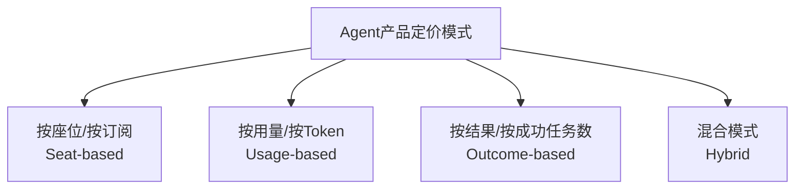
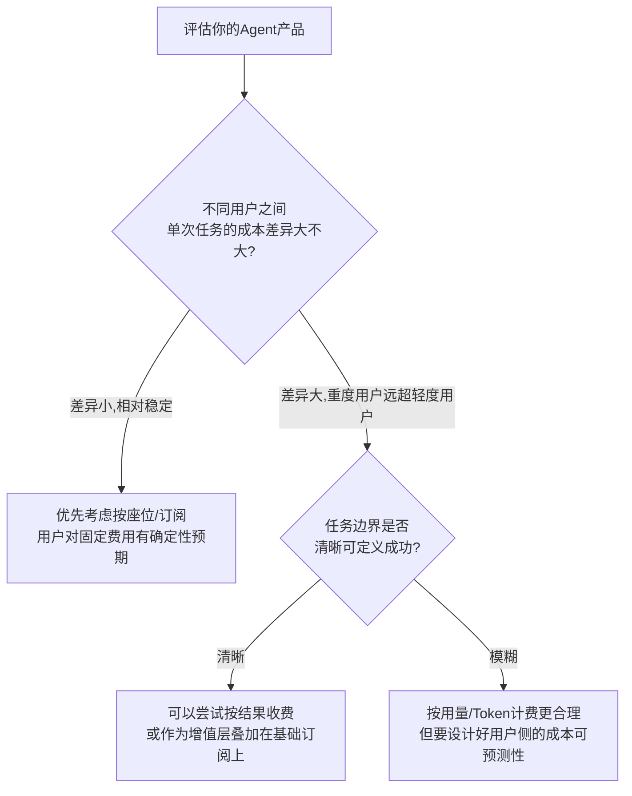

# 22 Agent 产品商业化与定价模式：怎么让 Agent 产品挣钱

## 为什么 Agent 的成本结构和传统 SaaS 完全不同

传统 SaaS 产品的边际成本极低——多一个用户登录系统，几乎不增加额外成本，所以"按座位收费"是最自然的定价模式。**Agent 产品打破了这个假设：每一次对话、每一次工具调用、每一步自主推理，背后都是真实的 Token 消耗，而且消耗量不是线性的。** 一个任务如果需要 Agent 多轮自主试错才能完成（比如 L2 自主规划循环里反复调用工具、反复检查结果），Token 成本会随着上下文越堆越长而**非线性增长**——第10轮对话消耗的 Token，可能是第1轮的好几倍，因为每一轮都要把前面所有的上下文重新喂给模型。**这意味着"一个用户"在 Agent 产品里的真实成本，远比传统 SaaS 里的"一个用户"波动更大，按座位收费很容易出现"少数重度用户吃掉大部分利润"的情况。**

## 常见定价模式对比

| 模式 | 逻辑 | 适合场景 | 最大风险 |
|---|---|---|---|
| 按座位/订阅 | 固定月费，不限用量或有软性上限 | 使用量相对稳定、可预测的场景（比如企业内部工具类Agent） | 重度用户远超预期用量时，公司自己承担成本，容易亏本 |
| 按用量/Token | 用多少付多少，跟真实成本强绑定 | 用量差异极大的场景（有人偶尔用，有人天天高频用） | 用户对"多轮对话到底花了多少钱"没有直觉，容易产生"账单突然很贵"的负面体验 |
| 按结果/成功任务 | 只对"任务真正完成"收费，没完成不收费或少收 | 任务边界清晰、能明确定义"成功"的场景（比如帮用户完成一次预定、生成一份可用的方案） | 定义"什么算成功"本身有争议空间，且公司要承担"没成功也已经消耗了Token"的成本兜底 |
| 混合模式 | 基础订阅费+超出部分按量计费 | 大多数成熟 Agent 产品的实际选择 | 设计复杂度更高，需要说清楚"基础额度包含什么，超出怎么算" |

**结果导向的按结果收费，理论上最贴合"用户价值"，但在真实产品中最难落地**——因为"任务成功"往往涉及主观判断（比如一份 AI 生成的方案，用户觉得"凑合能用"和"完全满意"之间没有清晰的成功/失败分界线），公司很难只凭"任务是否成功"这一个信号去做收费判断，通常还是要退回到"按用量+设一个满意度保障机制"的混合思路。

## 决策框架：怎么给自己的 Agent 产品选定价模式

## 一个容易被忽视的环节：让用户能"预感到"自己要花多少钱

无论选哪种定价模式，**Agent 产品因为"一次任务可能需要多轮交互"，用户很难像传统按次付费产品那样，直觉地估算出"这次任务大概要花多少钱"。** 这跟满意度直接挂钩——一个用户如果在使用中途突然发现账单比预期高得多，产生的负面情绪会远超过"这个功能真的贵"本身带来的影响。产品设计上值得配套做的事：**在任务开始前给出一个大致的成本区间预估、在多轮对话中途适时提示当前已消耗量、给重度使用场景设计一个"封顶价"的心理安全线**（哪怕实际成本会超出封顶价，公司愿意为了用户体验兜底这部分差额，用可控范围内的让利换取长期信任）。

## 产品经理清单

> - [ ] 我有没有测算过，不同类型用户在我的Agent产品里，单次任务的真实Token成本差异有多大？如果差异很大，按座位收费的商业模型可能站不住。
> - [ ] 我的定价模式，有没有让用户在使用前/使用中能大致预感到"这次会花多少钱"，而不是等账单出来才知道？
> - [ ] 如果考虑按结果收费，我能不能清晰定义"什么算成功"？如果定义本身很模糊，说明这个模式现在还不成熟。
> - [ ] 我有没有给重度使用场景设计一个可控的成本上限/兜底机制，避免因为极端case的账单冲击伤害用户信任？

## 小结

Agent 产品的商业化设计，本质上是在**"真实成本结构（非线性、差异大）"和"用户对费用的确定性预期"之间找平衡**——这跟传统 SaaS 定价最大的不同在于，你不能假设"一个用户的成本大致恒定"，必须把"任务复杂度带来的成本波动"作为定价模型设计的第一变量来考虑，而不是事后才发现利润被少数重度用户吃掉。

下一章，我们从"怎么挣钱"进入"怎么带团队把这件事做成"——Agent 项目的团队协作与项目管理。

## 章节自测（5道单选，答案见文末）

**Q1.** 为什么Agent产品的成本结构和传统SaaS不同？
A. Agent产品用户更少　B. 每次对话/工具调用/推理都消耗真实Token，且随对话轮次/上下文长度非线性增长　C. Agent产品不需要服务器　D. 两者完全一样

**Q2.** 按结果/成功任务收费模式最大的落地难点是什么？
A. 技术上无法实现　B. "任务成功"往往涉及主观判断，很难只凭这一个信号做收费判断，通常仍需退回按用量+满意度保障的混合思路　C. 用户不接受这种模式　D. 没有难点

**Q3.** 决策框架中，什么情况下更适合按用量/Token计费而不是按座位收费？
A. 所有场景都该按座位收费　B. 不同用户之间单次任务成本差异很大（重度用户远超轻度用户）时　C. 用户数量少的时候　D. 成本差异小的时候

**Q4.** 文中提到，为什么要让用户能"预感到"自己要花多少钱？
A. 这不重要　B. 账单突然超预期会带来远超"功能本身贵"的负面情绪，损害用户信任　C. 只是为了好看　D. 用户从不关心费用

**Q5.** 文中建议给重度使用场景设计什么机制？
A. 直接限制使用　B. 设计一个可控的成本上限/封顶价兜底机制，用可控让利换取长期信任　C. 不需要任何机制　D. 提高所有用户的价格

点击查看参考答案

1-B　2-B　3-B　4-B　5-B

