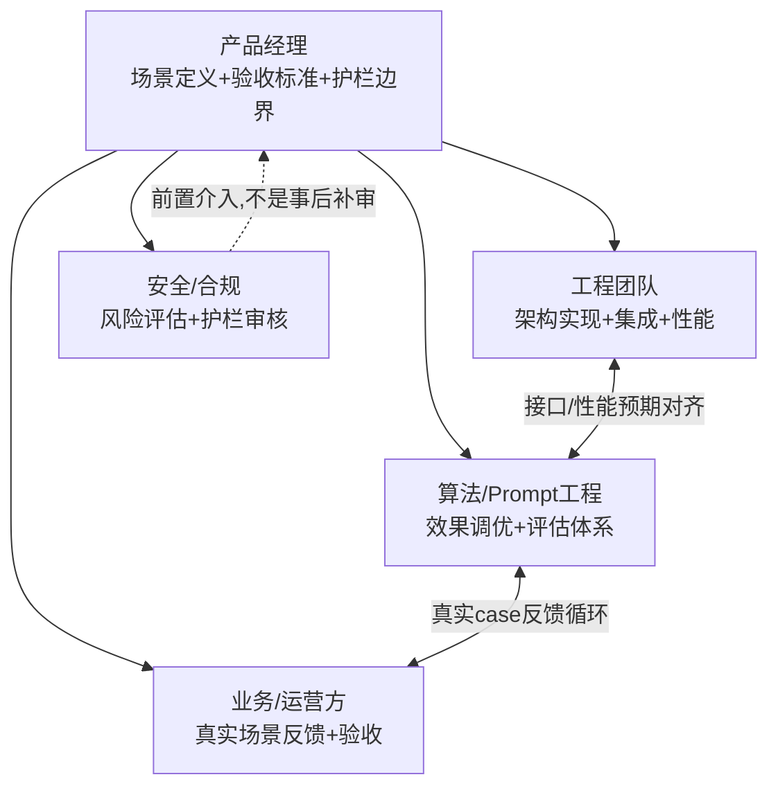

# 23 团队协作与项目管理：怎么带团队把 Agent 项目做成

## 为什么 Agent 项目比传统项目更难管理

传统软件项目的需求文档写清楚了"输入什么、输出什么、边界条件是什么"，团队照着实现，验收标准也相对客观。**Agent 项目的特殊之处在于——效果本身有不确定性，产品经理很难在项目启动时就给出"做到什么程度算完成"的精确定义**，因为 Agent 的表现会随着 Prompt 调整、模型版本迭代、真实用户输入的多样性而持续变化。这直接导致 Agent 项目管理上最常见的两个失败模式：**要么需求写得太模糊，工程团队不知道做到什么程度算达标，做到一半发现方向理解完全不一致；要么需求写得像传统功能清单一样精确，工程团队严格照做，结果发现"技术上实现了但产品体验完全不对"——因为 Agent 的好坏本来就不是靠功能清单能定义清楚的。**

我做企业微信群机器人项目时经历的正是这套磨合过程——最初的需求是"@机器人能查数据报表、能回答业务问题"，这个描述对工程团队来说太模糊，落地时踩了不少"平台限制没提前对齐、字段解析格式两边理解不一样"的坑；后来改成"给出具体场景样例+可接受的错误类型+护栏边界"的需求写法，团队协作效率明显不一样。

## 跨部门协作框架：Agent 项目通常涉及的四类角色



**这套协作框架里最容易被低估的一环是"安全/合规"角色需要前置介入，而不是等产品做完了才补一道审核。** 呼应 Part 3 第14章讲的安全治理——权限设计、护栏动作清单这些东西，如果在项目立项阶段就没有安全视角参与，等到产品做完了再补，往返修改的成本会远高于前置设计的成本。

## 需求管理：Agent 产品的需求文档该怎么写

传统需求文档的核心是功能清单，Agent 产品的需求文档核心应该是**场景+护栏+验收标准**三件套，缺一不可：

| 要素 | 该写什么 | 常见的错误写法 |
|---|---|---|
| 场景 | 具体到"用户会怎么问、在什么上下文下问"的真实样例，而不是抽象的功能描述 | "支持智能问答"（这不是需求，是愿景） |
| 护栏 | 明确"这个Agent不应该做什么"——权限边界、高风险动作清单、拒答范围 | 完全没提护栏，等出了问题才临时补 |
| 验收标准 | 用一批真实/模拟的case，定义"什么算通过"，而不是"看起来好用就行" | 验收标准主观模糊，导致上线前反复拉锯"这样算不算做完" |

**"场景样例"这一项尤其关键**——与其写"用户可以查询任意报表数据"，更有效的写法是列出10-20条真实的用户提问样例（包括一些刁钿、边界模糊的问法），让工程和算法团队能直接对照样例判断当前版本行不行，而不是靠抽象描述各自脑补理解。

## 决策框架：Agent 项目遇到分歧时，怎么快速拉齐

```mermaid
flowchart TD
    Conflict[团队对"这个效果算不算达标"产生分歧] --> Q1{分歧是关于场景理解<br/>还是关于护栏边界?}
    Q1 --场景理解不一致--> S1[回到具体case样例逐条过<br/>不要在抽象描述层面争论]
    Q1 --护栏边界不一致--> S2[拉安全/合规角色进来对齐<br/>护栏问题不该由产品/工程单方面决定]
    S1 --> Q2{过完case后<br/>是否达成一致?}
    Q2 --否--> S3[说明验收标准本身需要重新定义<br/>而不是继续在同一套标准下拉锯]
```

## 一个真实的协作教训：技术架构决策不该只是工程团队内部的事

在企业微信机器人项目的迭代过程中，一开始技术选型完全是工程侧自己决定的（先用低代码平台快速验证），后来发现平台存在局限需要重构成自建服务时，因为**产品侧没有提前理解这个架构决策会带来的能力边界变化**，导致业务方对"为什么突然要重构"缺乏共识。**这暴露了一个常见问题——产品经理不需要懂具体的技术实现细节，但必须理解每一次重大架构选型（要不要用低代码平台、要不要自建服务、要不要接入MCP协议）会带来什么能力/成本/维护性的权衡，否则在关键节点上产品经理会变成"只能被动接受工程团队决定"的旁观者，而不是真正的项目负责人。**

## 产品经理清单

> - [ ] 我的需求文档里，有没有具体的场景样例（真实提问case），还是只有抽象的功能描述？
> - [ ] 安全/合规视角有没有在项目立项阶段就介入，还是打算等产品做完了再补一道审核？
> - [ ] 我的验收标准是"一批具体case过没过"，还是"看起来好用就行"这种主观模糊的说法？
> - [ ] 对于工程团队做的重大架构决策，我是否理解它带来的能力边界和成本权衡，还是完全被动接受？

## 小结

Agent 项目的团队协作，核心难点不是"沟通不够多"，是**"传统需求管理方法论天然假设的确定性，在Agent场景里不成立"**——场景样例代替抽象功能描述、护栏前置介入代替事后补审、具体case验收代替主观标准，这三个转变做到位，团队协作的摩擦会显著降低。

到这里，Part 6 全部结束——从多模态产品设计、到怎么验证效果、到怎么商业化、到怎么带团队落地，这套"产品化跃升"的方法论补上了 Part 1~5 里没有覆盖的组织和商业维度。

## 章节自测（5道单选，答案见文末）

**Q1.** 文中认为Agent项目管理最常见的两个失败模式是什么？
A. 团队人数太少　B. 需求太模糊导致理解不一致，或需求写得像功能清单一样精确但体验不对　C. 预算不够　D. 没有失败模式

**Q2.** 为什么"安全/合规"角色需要在项目立项阶段就介入？
A. 不需要介入，事后补审就够　B. 权限设计、护栏动作清单如果立项阶段没有安全视角参与，等做完再补的返工成本会远高于前置设计　C. 这是走流程　D. 安全团队要求必须参与

**Q3.** Agent产品需求文档的"三件套"是什么？
A. 功能、时间、预算　B. 场景（具体样例）+ 护栏（不该做什么）+ 验收标准（具体case过没过）　C. 只需要功能清单　D. 只需要时间表

**Q4.** 文中为什么强调"场景样例"比"抽象功能描述"更有效？
A. 样例更好看　B. 具体case能让工程和算法团队直接对照判断版本行不行，而不是靠抽象描述各自脑补　C. 样例写起来更快　D. 没有区别

**Q5.** 文中提到的"技术架构决策"教训说明了什么？
A. 产品经理不需要关心技术决策　B. 产品经理必须理解重大架构选型带来的能力/成本权衡，否则会变成被动接受工程决定的旁观者　C. 工程团队应该完全自主决策不需要沟通　D. 架构决策不重要

<details>
<summary>点击查看参考答案</summary>

1-B　2-B　3-B　4-B　5-B

</details>
